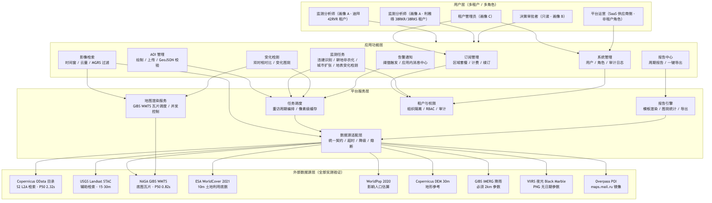
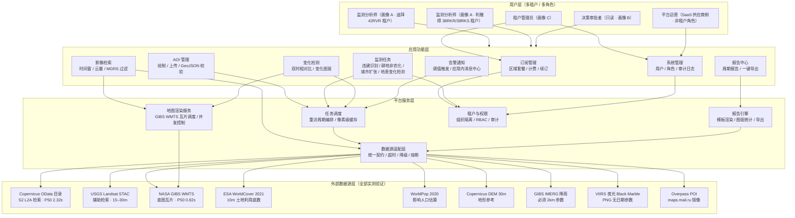
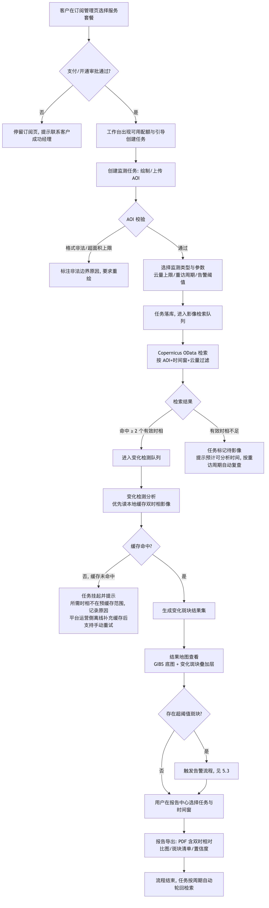
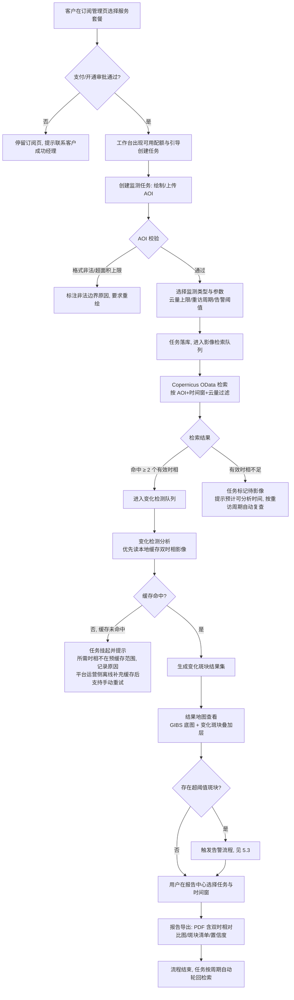
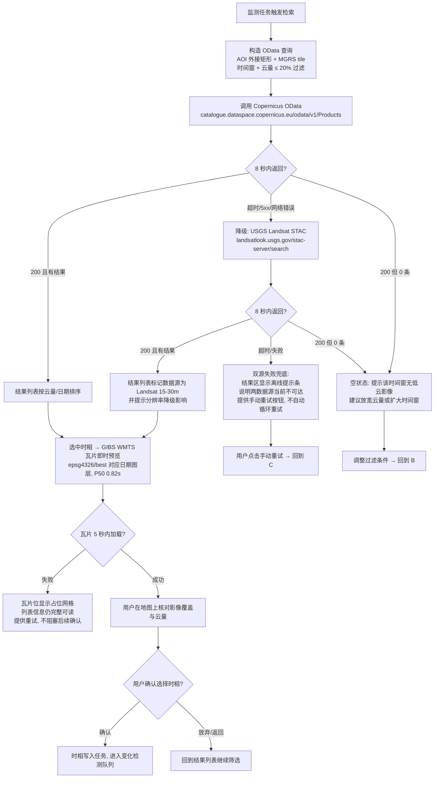
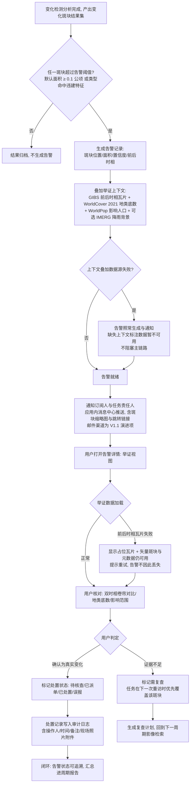

# 卫星遥感监测 SaaS 平台 MVP 产品需求文档（PRD）

| 属性 | 内容 |
|---|---|
| 版本 | V1.0 |
| 日期 | 2026-09-27 |
| 状态 | 已评审定稿（各章节草稿经跨章节一致性评审后汇编合并） |
| 作者 | 产品团队 |

---

## 目录

- [第 1 章 产品概述与目标市场](#1-产品概述与目标市场)
  - [1.1 产品背景与问题定义](#11-产品背景与问题定义)
  - [1.2 产品定位与价值主张](#12-产品定位与价值主张)
  - [1.3 产品边界（MVP）](#13-产品边界mvp)
  - [1.4 目标市场：中东政府客户（迪拜、利雅得）](#14-目标市场中东政府客户迪拜利雅得)
  - [1.5 目标客户画像（机构层面）](#15-目标客户画像机构层面)
  - [1.6 竞品与差异化](#16-竞品与差异化)
  - [1.7 商业模式概述](#17-商业模式概述)
- [第 2 章 用户画像与角色权限](#2-用户画像与角色权限)
  - [2.1 目标客户与用户概述](#21-目标客户与用户概述)
  - [2.2 用户画像](#22-用户画像)
  - [2.3 多租户与角色权限模型](#23-多租户与角色权限模型)
- [第 3 章 用户故事](#3-用户故事)
  - [3.1 订阅与任务管理线（US-01 ~ US-06）](#31-订阅与任务管理线us-01--us-06)
  - [3.2 监测结果与报告线（US-07 ~ US-12）](#32-监测结果与报告线us-07--us-12)
- [第 4 章 功能架构](#4-功能架构)
  - [4.1 架构总览](#41-架构总览)
  - [4.2 模块职责说明](#42-模块职责说明)
  - [4.3 数据源适配层设计](#43-数据源适配层设计)
  - [4.4 多租户数据隔离在架构中的落点](#44-多租户数据隔离在架构中的落点)
- [第 5 章 主流程](#5-主流程)
  - [5.1 核心主流程](#51-核心主流程订阅--创建监测任务--影像检索--变化检测--结果查看--报告导出)
  - [5.2 影像检索与可视化流程（外部数据源故障降级设计）](#52-影像检索与可视化流程外部数据源故障降级设计)
  - [5.3 告警流程](#53-告警流程变化检测--告警生成--通知--举证查看--处置闭环)
  - [5.4 流程级设计约束（汇总）](#54-流程级设计约束汇总)
- [第 6 章 MVP 范围与裁剪逻辑、数据源策略与 SLA](#6-mvp-范围与裁剪逻辑数据源策略与-sla)
  - [6.1 MVP 范围裁剪逻辑](#61-mvp-范围裁剪逻辑)
  - [6.2 数据源策略与 SLA](#62-数据源策略与-sla)
  - [6.3 非功能性需求](#63-非功能性需求)

---

## 1. 产品概述与目标市场

### 1.1 产品背景与问题定义

卫星遥感监测已成为城市治理、自然资源管理和耕地保护的核心手段，但对于绝大多数政府机构而言，「用上遥感」仍然意味着一条漫长而昂贵的自建链路：

- **获取门槛高**：影像检索需要理解 OData/STAC 等专业目录协议、MGRS 分幅编码与云量筛选规则；像素级影像下载普遍要求在 Copernicus Data Space、USGS ERS 等平台完成账号注册与授权（实测 CDSE 匿名下载返回 401、Landsat HTTPS 下载 302 跳转 ERS 登录），非专业人员难以独立完成。
- **处理链路长**：从辐射定标、大气校正、正射校正到变化检测算法（NDVI 差分、双时相比对），每一步都需要遥感专业团队和算力投入。一支具备完整能力的遥感处理团队，年度人力成本通常以数百万元计。
- **交付周期慢**：传统项目制采购从需求确认、数据采购、专题处理到报告交付往往以月计，无法支撑「发现违建→现场处置」这类对时效敏感的执法场景。
- **数据源分散且不稳定**：Sentinel、Landsat、土地利用、人口、DEM、降雨、夜光等数据散落在欧、美不同机构的门户中，接口协议各异、可用性参差不齐（实测 Google Cloud S2 公共桶 10 次仅 6 次成功、P50 高达 25.6s；AWS sentinel-cogs 桶禁止列目录且 EarthSearch 检索入口连接失败）。机构自建系统需要持续投入维护这些外部依赖。

**问题的本质**：政府客户需要的是「指定区域、指定周期、指定类型的监测结论」，而不是「卫星影像本身」。将影像检索、数据处理、变化检测、报告生成这条完整链路封装为标准化服务，以订阅方式交付，是本产品要解决的核心问题。

### 1.2 产品定位与价值主张

本产品是一款**面向政府客户的多租户卫星遥感监测 SaaS 平台**：客户在地图上圈定关注区域（AOI），按「区域面积 × 监测类型 × 重访频率」订阅监测服务，平台自动完成影像检索、变化检测与报告生成，客户在 Web 工作台上直接查看结果并导出证据报告。

**一句话价值主张**：

> 让政府客户像订阅软件一样订阅区域监测——无需自建遥感团队、无需处理一行影像数据，即可在 10 米级分辨率下按月、按周发现辖区内的违建、耕地非农化与地表变化，并以标准 SLA 获得可追溯的监测结论与执法证据。

支撑该主张的能力底座（均基于 2026-09-27 实测验证的公开数据源）：

- **检索层**：Copernicus Data Space OData 目录（`catalogue.dataspace.copernicus.eu/odata/v1/Products`，实测 10/10 成功、P50 2.32s，Sentinel-2 L2A 10m 影像延迟仅 5 天）+ USGS Landsat STAC（`landsatlook.usgs.gov/stac-server/search`，实测 10/10 成功，每年 75–155 景低云影像，15–30m 分辨率作为辅助），两者均免登录可达，检索体验可靠。
- **可视化层**：NASA GIBS WMTS 瓦片（实测 P50 0.82s）提供工作台底图与检索结果即时预览；IMERG 降雨（必须使用 2km 参数，6km 返回 400）、VIIRS 夜光（必须 PNG 且不带日期参数）提供分析背景层。
- **分析底数层**：ESA WorldCover 2021 10m 土地利用（迪拜 N24E054、利雅得 N21E045 分幅直链可下）、WorldPop 2020 人口栅格（ARE/SAU 直链可下）、Copernicus DEM 30m 地形，为耕地保护与影响人口估算提供基准。
- **辅助层**：Overpass POI（必须使用 `maps.mail.ru/osm/tools/overpass/api/interpreter` 镜像，overpass-api.de 主站返回 406）用于违建点位周边的环境核验。

### 1.3 产品边界（MVP）

MVP 版本聚焦四个高频监测类型——**违建识别、耕地非农化、城市扩张、地表变化检测**——以及支撑它们的五条核心链路：订阅管理、监测任务创建（AOI 圈选 + 检索条件）、监测结果查看（地图 + 变化图斑）、报告导出、多租户组织与权限管理。像素级分析所需的影像下载依赖一次性的 CDSE 免费注册（与检索同源闭环），由平台运营侧统一离线完成预下载并缓存，不向客户暴露任何注册流程，租户侧不做在线像素级下载。产品的多租户数据隔离（租户/组织/角色三级边界）既是工程基线，也是面向政府客户的核心卖点：不同部门、不同辖区的监测数据与 AOI 默认互不可见。

### 1.4 目标市场：中东政府客户（迪拜、利雅得）

MVP 阶段聚焦海湾地区两大都市——**迪拜（MGRS tile：42RVR）与利雅得（MGRS tile：38RKR/38RKS）**，选择该市场的依据如下：

**（1）治理场景高度匹配**

- **城市快速扩张**：两地均为全球城市化速度最快的都市区之一，迪拜 2000 年以来建成区面积成倍增长，利雅得在「沙特 2030 愿景」驱动下处于新一轮建设高峰。城市扩张边界的动态监测（占用沙漠/农用地转为建设用地的范围、速率、方位）是市政规划部门每年都要回答的问题，而这恰好是 Sentinel-2 10m + 双时相变化检测最能稳定交付的场景。
- **违建监管刚需**：快速扩张必然伴随未报批建设。监管方需要「周期性扫描全辖区 → 输出疑似新增建（构）筑物图斑 → 现场核查」的完整闭环，传统人工巡查难以覆盖城市边缘带的大面积未纳管区域。WorldPop 2020 人口栅格可对疑似违建图斑附加「影响人口」估算，提升处置优先级排序的客观性。
- **耕地/绿地保护**：海湾国家耕地资源极度稀缺，农业用地转为非农用途的监测（如利雅得周边绿洲农区）敏感性高，WorldCover 2021 10m 土地利用提供了可复用的基期底数。

**（2）国际公开数据源覆盖优良，链路可完整落地**

与部分区域相比，迪拜与利雅得在国际公开数据源上的覆盖与可得性均经过逐一实测确认：Copernicus Data Space OData 对 42RVR 与 38RKR/38RKS 的 Sentinel-2 L2A 检索全部成功且影像延迟仅 5 天；Landsat STAC 每年可提供 75–155 景低云影像，保证多云雨季也有重访兜底；GIBS 瓦片（P50 0.82s）承载工作台可视化；WorldCover、WorldPop、Copernicus DEM 三类栅格底数均有迪拜/利雅得对应分幅的直链可下。整条「检索 → 可视化 → 分析 → 报告」链路不依赖任何商业数据采购，MVP 的成本结构与交付确定性可控。

**（3）天时地利：数据新鲜度满足执法时效**

实测 Sentinel-2 L2A 影像延迟为 5 天，单星 5 天重访意味着理论上月内至少 5–6 次覆盖、年内有效重访 ≥ 11 次（多云筛除后），足以支撑「月度违建扫描 + 按需加急复核」的服务节奏，满足政府执法对时效的基本要求。

### 1.5 目标客户画像（机构层面）

| 客户类型 | 典型部门 | 核心诉求 | 首选监测类型 |
|---|---|---|---|
| 市政规划/城建监管部门 | 城市规划局、市政巡查执法机构（如迪拜 Municipality、利雅得皇家委员会相关条线） | 掌握建成区扩张动态，及早发现未报批建设，缩短「发现—处置」周期 | 违建识别、城市扩张监测 |
| 自然资源/农业部门 | 自然资源、农业农村主管部门（如沙特环境、水利与农业部相关条线） | 守住稀缺农用地底线，量化耕地/绿洲非农化趋势，支撑年度上报 | 耕地非农化监测、地表变化检测 |
| 应急/环境条线（MVP 后续拓展） | 民防、环保机构 | 暴雨内涝受灾范围、降雨背景分析（IMERG 2km） | 地表变化检测（灾后评估） |

MVP 以**市政规划部门**与**自然资源/农业部门**为首批目标客户，终端用户画像详见第 2 章，用户故事详见第 3 章。

### 1.6 竞品与差异化

| 竞品类型 | 代表 | 其短板 | 本产品差异化 |
|---|---|---|---|
| 传统遥感项目制服务商 | 各国营/民营测绘遥感院所、咨询公司 | 项目制交付，按次计价、周期以月计；客户需自提需求规格；无自助产品界面 | 订阅制 SaaS：客户自助圈选 AOI、按月/周自动获得结果；SLA 明确可考核（检索 P99 < 4s、影像延迟 ≤ 5 天、年内重访 ≥ 11 次） |
| 商业卫星影像平台 | Planet、Airbus OneAtlas、Maxar 等 | 按景/按 km² 售卖影像与 API，面向有处理能力的专业团队；单价高，客户仍需自建分析能力 | 交付的是「监测结论 + 图斑 + 报告」而非影像；基于免费公开数据源（Sentinel-2/Landsat），将客户成本从「影像采购 + 团队」压缩为「固定订阅费」 |
| 免费数据门户 | Copernicus Browser、USGS EarthExplorer、GIBS Worldview | 面向专业用户的通用工具：无 AOI 订阅、无自动变化检测、无报告导出、无组织协作与数据隔离 | 把这些门户背后的数据源封装为业务化服务：AOI 订阅 → 自动检索 → 变化检测 → 图斑核查工作流 → 报告导出，并叠加多租户权限体系 |

**差异化核心**不在「拥有独家数据」——数据全部来自公开渠道——而在：**（a）把专业检索/处理链路封装为零门槛的订阅服务；（b）面向政府工作流（图斑核查、证据留存、报告导出）做深；（c）多租户数据隔离与权限体系天然匹配政府多部门协作场景；（d）以实测 SLA 数字给出可考核的服务承诺。**

### 1.7 商业模式概述

采用**「区域面积 × 监测类型 × 重访频率」三维组合的年度订阅制**，以标准分档降低报价复杂度，同时允许大客户定制。

**定价三维度的设定依据**：

- **面积**：决定每期影像检索与变化检测的计算量（Sentinel-2 单景覆盖约 100km × 100km，迪拜主城区约可落在 1–2 个 MGRS tile 内）；
- **监测类型**：违建识别与耕地非农化需要像素级双时相比对 + 图斑分类，成本高于一般地表变化检测；
- **重访频率**：月度（约 5–6 次卫星覆盖中选优）为标准档，双周/周度档需要叠加 Landsat（15–30m）作为兜底并提高筛选算力投入。

**分档示例（MVP 试报价，币种：美元/年，面积按辖区有效监测面积计）**：

| 档位 | 面积上限 | 监测类型 | 重访频率 | 服务内容 | 参考定价 |
|---|---|---|---|---|---|
| 基础版 | ≤ 500 km² | 任选 1 类 | 月度 | 1 个组织、≤ 5 席位、月度监测简报（PDF）、变化图斑地图查看 | $24,000/年 |
| 专业版 | ≤ 2,500 km² | 任选 2 类 | 月度 + 每季度 1 次加急复核 | 3 个子组织、≤ 20 席位、图斑级证据导出（含前后时相影像截图）、API 只读接口 | $78,000/年 |
| 旗舰版 | ≤ 10,000 km²（约一个 MGRS tile 全覆盖） | 全部 4 类 | 双周（Sentinel-2 为主，Landsat 兜底） | 不限子组织、≤ 100 席位、SSO 接入、专属成功经理、自定义报告模板 | $220,000/年 |
| 定制版 | 不限 | 可扩展（如灾后评估、夜光经济活跃度分析） | 协商（最低周度） | 私有部署选项、定制数据接入 | 一事一议 |

**商务要点**：

1. 订阅按租户（政府机构）开通，租户内可按辖区/科室建立子组织实现数据隔离，档位内席位与子组织数可按需增购；
2. 各档 SLA 一致且写进合同：目录检索 P99 < 4s、影像延迟 ≤ 5 天、年内有效重访 ≥ 11 次（均为 2026-09-27 实测口径）；
3. 相比「自建遥感团队（数百万元/年人力）+ 商业影像采购」的替代方案，旗舰版年费约为其 1/5–1/10，这是向预算部门传达的核心采购理由。

---

## 2. 用户画像与角色权限

### 2.1 目标客户与用户概述

本平台以订阅制 SaaS 形式向中东政府客户交付卫星遥感监测服务，客户覆盖两类典型城市：迪拜（阿联酋，MGRS tile 42RVR）与利雅得（沙特，MGRS tile 38RKR / 38RKS）。客户的共同特征是：**有持续的领土监测诉求（违建识别、耕地非农化、城市扩张、地表变化检测），但没有自建遥感处理团队，也不愿承担卫星数据采购、辐射定标、云掩膜、变化检测算法研发等一次性投入**。

基于对迪拜市政厅（Dubai Municipality）规划监察体系与沙特农业部（Ministry of Environment, Water and Agriculture, MEWA）利雅得分支业务结构的调研抽象，我们识别出三类核心画像：**一线监测分析师、部门决策审批者、租户管理员（IT/数据治理岗）**。三类画像覆盖「执行—决策—治理」完整链路，分别对应产品的监测工作流（检索、变化检测、报告）、汇报视图（工作台、只读报告）与租户治理（订阅、用户、预缓存数据配额）。

### 2.2 用户画像

#### 画像 A：Ahmed Al Mansouri —— 一线监测分析师（核心用户）

| 维度 | 内容 |
|---|---|
| 姓名/职务 | Ahmed Al Mansouri，遥感监测分析师（Senior Monitoring Analyst） |
| 所在机构 | 迪拜市政厅（Dubai Municipality）规划监察部门（Buildings Inspection & Planning Compliance） |
| 年龄/背景 | 34 岁，地理信息科学硕士，曾在工程咨询公司做 GIS 分析师 6 年 |
| 核心职责 | 负责迪拜酋长国范围内（重点为 42RVR tile 覆盖的迪拜主城区及杰贝阿里—哈塔沿线）的违建扩张与未经审批建设的卫星监测；每周向规划监察队长提交一份变化热点清单，供外勤核查小组派单 |
| 痛点 | ① 迪拜海岸线与沙漠过渡带合计约 **200 公里巡查线**，外勤全员巡一遍需 3 周，违建从开工到封顶可能不足一个月，巡查周期赶不上建设速度；② 现有手段是人工在免费影像查看器里翻拍截图，无历史基线、无变化比对，截图无法作为执法立案证据链的一部分；③ Sentinel-2 影像本身免费，但自助下载需要注册 Copernicus Data Space、写脚本做云掩膜和双时相比对，部门里没有工程师能维护这套流程；④ 申购商业变化检测服务，一个项目报价数十万迪拉姆，且每次扩大监测范围都要重新议价 |
| 典型场景 | 周一上午登录平台，工作台地图（NASA GIBS WMTS 底图，实测 P50 0.82s 加载）上叠加上周新到的一片 Sentinel-2 L2A 影像（Copernicus Data Space OData 目录检索，实测 P50 2.32s、最新影像延迟仅 5 天）；在杰贝阿里自贸区南缘的订阅 AOI 内运行双时相变化检测，平台标出 17 处地表变化斑块；他逐一查看斑块的前后时相影像与 ESA WorldCover 2021 10m 土地利用底数（该斑块底数为裸地），剔除 4 处明显是沙丘移动的误报，将剩余 13 处按置信度排序，导出带坐标与前后影像截图的 PDF 报告，推送给外勤组长派单核查 |
| 成功标准 | ① 每周产出覆盖全部订阅 AOI 的变化热点清单，从新影像可获取（延迟 ≤ 5 天）到清单产出不超过 1 个工作日；② 单个斑块的核查定位精度足够外勤用手机导航直达（10m 级，与 WorldCover / Sentinel-2 10m 分辨率匹配）；③ 全年可用影像 ≥ 11 景重访（多云雨季靠 Landsat 15–30m 辅助检索兜底，USGS STAC 实测每年 75–155 景低云景可筛选）；④ 误报率逐步下降，裸地/沙区的植被-沙地混淆斑块可通过土地利用底数交叉核验过滤 |
| 技术熟练度 | 高。熟练使用 QGIS、理解 NDVI/双时相比对原理、看得懂 MGRS 编号与云量参数；不会写生产级代码，但能阅读 API 文档并使用 Postman。对平台的期望是「把遥感工程链路产品化，我只做判断」 |

#### 画像 B：Fatima Al Otaibi —— 部门决策审批者（只读汇报型用户）

| 维度 | 内容 |
|---|---|
| 姓名/职务 | Fatima Al Otaibi，副司长（Director of Land Monitoring Division） |
| 所在机构 | 沙特阿拉伯环境、水利与农业部（MEWA）利雅得分支，耕地保护与土地用途管制条线 |
| 核心职责 | 对利雅得周边（38RKR / 38RKS tile）农业用地转为非农用途的季度态势负责；每月向利雅得王室委员会规划协调会汇报城市扩张侵占耕地的规模、位置与趋势，并对外勤核查处置结果做闭环确认 |
| 痛点 | ① 现有汇报材料依赖下级单位层层上报的 Excel 与 PPT，数据口径不一、时滞长达一个季度，会上被质询「数字是哪天的影像、哪天的地面核查」时无法回答；② 无法回答「利雅得东北走廊过去两年到底占了多少公顷耕地」这类追溯性问题，因为没有统一基线（WorldCover 2021 这类底数从未被系统性使用）；③ 人口与灌溉压力对耕地的影响只有定性描述，缺乏可量化佐证 |
| 典型场景 | 季度汇报前，登录平台只读视图：在利雅得订阅 AOI 上查看本季度耕地非农化变化检测汇总（含 2021 WorldCover 底数比对出的转用面积、斑块分布）；调出 WorldPop 2020 人口栅格叠加，说明转用地块 5 公里半径内影响人口规模；点开两个已被外勤确认的典型斑块查看处置前后影像作为闭环证据；一键导出带方法学附注（数据源、成像日期、分辨率）的官方格式报告用于上会。她本人从不创建任务、不修改任何数据 |
| 成功标准 | ① 每季度 10 分钟内即可调出口径一致、可追溯（每个数字可下钻到具体影像日期与坐标）的态势报告；② 报告中的每个结论都自带数据源与成像时间标注，可经受上级质询；③ 处置闭环状态（待核查/已确认/已拆除/误报）在平台内可见，不需要再拉电话会核对 |
| 技术熟练度 | 中低。不使用 GIS 桌面软件，日常以浏览器与移动端为主；对地图的要求是「点开即看、缩放不卡」，不理解投影、云量阈值等术语，需要平台用业务语言（"高置信度新增建设"而非 "NDVI 下降且 SAR 后向散射上升"）呈现 |

#### 画像 C：Khalid Al Hashemi —— 租户管理员（IT 与数据治理岗）

| 维度 | 内容 |
|---|---|
| 姓名/职务 | Khalid Al Hashemi，信息治理主管（Head of Data Governance） |
| 所在机构 | 迪拜市政厅数字化转型办公室（Digital Dubai / Municipality IT 共同派驻） |
| 核心职责 | 负责市政厅全部 SaaS 采购的账号、权限与数据安全治理；对本平台，他管理市政厅这一个租户下的全部用户（规划监察、环保、海岸线管理等约 25 个账号）、订阅额度（当前订阅 3 个监测 AOI 包），以及预缓存数据源（像素级分析影像、土地利用底数等）的配额与覆盖范围管理 |
| 痛点 | ① 此前采购的遥感工具按个人账号发许可，员工调岗后账号仍在用、监测数据散落在个人空间，审计时说不清"谁看到了哪些区域的什么数据"；② 多个部门共用一个工具时，海岸线管理部门不应看到规划监察部门的在办案件，缺乏隔离手段；③ 此前工具的像素级影像下载依赖员工个人注册的数据源账号（如 CDSE 注册账号），凭证曾以明文存在离职员工个人笔记中，无法统一治理 |
| 典型场景 | 新财年，海岸线管理部门申请接入平台。Khalid 在租户管理后台为他们创建独立的空间与用户组，分配「监测分析师」角色，但将其 AOI 订阅额度与规划监察部门分开核算；为副厅长等 4 人开通「决策审批者」只读角色；同时查看预缓存数据源的配额与覆盖状态（像素级分析影像由平台运营侧离线预下载并缓存，租户侧不持有任何下载凭证，对分析师完全透明）；季度末导出审计日志（谁在何时检索/导出了哪些 tile 的数据）用于内审 |
| 成功标准 | ① 任何时刻能在管理后台回答"某用户能看到哪些 AOI、过去 90 天导出过什么"；② 部门间数据默认不可见，共享必须显式授权且有记录；③ 租户侧零数据源凭证暴露（像素级数据由平台预缓存供给，无需任何员工持有下载账号）；④ 账号全生命周期（创建、转岗、停用）5 分钟内可完成，不依赖厂商人工支持 |
| 技术熟练度 | 高。熟悉 SSO/OIDC、SCIM、审计日志导出；会核对平台的租户隔离声明与数据驻留要求；对 SLA 数字（检索 P99 < 4s、影像延迟 ≤ 5 天）敏感，要求写进合同附件 |

### 2.3 多租户与角色权限模型

#### 2.3.1 三级结构：组织（租户）→ 用户 → 角色

平台采用三级权限结构，数据隔离是本产品的核心卖点，需在架构与 UI 两层显性体现：

```
组织 / 租户（Organization）
 └─ 例如「Dubai Municipality」「MEWA Riyadh Branch」
     ├─ 订阅（Subscription）：N 个监测 AOI 包 × 订阅周期
     ├─ 用户（User）：租户内唯一账号，支持 SSO（OIDC）
     │    └─ 角色（Role）：租户管理员 / 监测分析师 / 决策审批者（只读）
     └─ 资源：AOI、监测任务、变化检测结果、报告、审计日志
```

**数据隔离边界（产品级承诺，非实现细节）：**

1. **租户级硬隔离**：AOI、监测任务、变化检测结果、报告、审计日志均以租户为主键隔离，任何查询在数据访问层强制注入租户过滤，跨租户访问在服务端直接拒绝（403），而非前端隐藏。
2. **租户内空间（Space）级隔离**：一个租户可划分多个空间（如"规划监察部""海岸线管理部"），空间之间资源默认互不可见；跨空间共享需显式授权并记入审计日志——这直接回应画像 C 的核心诉求。
3. **角色最小权限**：角色决定"能做什么操作"，空间决定"能对哪些资源做"，两者正交叠加。
4. **凭证与预缓存数据治理**：需注册的数据源凭证不进入租户侧——像素级影像由平台运营（SaaS 供应商侧）统一使用离线 CDSE 注册凭证完成预下载并缓存，租户管理员仅管理预缓存数据源的配额与覆盖范围；任何凭证内容对终端用户不可见、不进入任何日志与响应。
5. **UI 显性表达**：界面上始终显示当前租户与空间标识（如「Dubai Municipality · 规划监察」），切换空间即时生效；审计日志对具备导出权限的角色可见，保证"谁看了什么"可追溯。

#### 2.3.2 角色定义

| 角色 | 定位 | 典型持有人 |
|---|---|---|
| **租户管理员**（Tenant Admin） | 租户治理者：管订阅、管用户、管空间、管预缓存数据配额、管审计 | 画像 C（信息治理主管） |
| **监测分析师**（Monitoring Analyst） | 业务执行者：创建与运行监测任务、检索影像、执行变化检测、判读与标注、生成报告 | 画像 A（一线监测分析师） |
| **决策审批者**（Decision Viewer，只读） | 汇报与决策者：查看工作台态势、查看检测结果与报告、确认处置闭环状态、导出官方报告 | 画像 B（部门副司长） |

#### 2.3.3 角色权限矩阵

| 能力 / 权限 | 租户管理员 | 监测分析师 | 决策审批者（只读） |
|---|:---:|:---:|:---:|
| 查看工作台态势总览（租户级） | ✅ | ✅（限所属空间） | ✅（限所属空间） |
| 查看 AOI / 监测任务 / 检测结果 | ✅ | ✅（限所属空间） | ✅（限所属空间） |
| 创建 / 编辑 / 删除 AOI | ❌ | ✅（限所属空间） | ❌ |
| 创建 / 编辑监测任务（选数据源、时相、云量阈值） | ❌ | ✅（限所属空间） | ❌ |
| 影像检索（Copernicus OData / Landsat STAC）与地图浏览（GIBS WMTS） | ❌ | ✅ | ✅（随结果查看，不可发起检索） |
| 触发基于预缓存影像的变化检测分析（消耗订阅额度；影像由平台运营侧离线预下载缓存） | ❌ | ✅（限所属空间） | ❌ |
| 变化斑块判读、标注置信度、标记误报 | ❌ | ✅ | ❌ |
| 确认处置闭环状态（待核查 → 已确认 / 误报 / 已处置） | ❌ | ✅ | ✅（仅状态确认，不可改判读） |
| 查看 / 导出监测报告（PDF，含数据源与成像日期附注） | ✅ | ✅（限所属空间） | ✅（限所属空间） |
| 管理订阅（新增 / 续订 / 变更 AOI 监测包） | ✅ | ❌（仅可见额度余量） | ❌ |
| 用户与空间管理（创建账号、分配角色、调整空间归属、停用） | ✅ | ❌ | ❌ |
| 跨空间共享授权 | ✅ | ❌（可发起共享申请） | ❌ |
| 预缓存数据源配额与覆盖管理（像素级影像由平台运营侧离线预下载，租户侧不持有任何下载凭证） | ✅（唯一可写方） | ❌（使用时透明） | ❌ |
| 查看 / 导出审计日志（检索、分析、导出、权限变更记录） | ✅ | ❌ | ❌（可查看与自身相关的记录） |
| 访问 API Key / 对接集成 | ✅ | ✅（限所属空间范围） | ❌ |

> 说明：租户管理员默认不参与业务操作（不建任务、不判读），以保证"治理与执行分权"——这是应对政府客户内审与合规质询的设计，而非权限缺失；如需兼任，可同一用户叠加多角色。

#### 2.3.4 权限模型对三类画像的覆盖验证

- 画像 A（监测分析师）：在"规划监察"空间内完成从检索（Copernicus OData，P50 2.32s）到变化检测、判读、报告生成的全流程，无需接触任何数据源凭证；沙区误报可用 WorldCover 2021 底数交叉核验后标记关闭。
- 画像 B（决策审批者）：只读视图即可完成季度汇报全链路——态势总览、耕地转用面积、WorldPop 影响人口叠加、闭环状态确认、官方报告导出，全程不产生数据变更风险。
- 画像 C（租户管理员）：订阅、用户、空间、预缓存数据配额、审计五项治理动作全部自助完成；"海岸线管理部"接入后与"规划监察部"天然隔离，跨部门共享显式授权且留痕，直接消除其审计痛点。

---

## 3. 用户故事

本章用户故事（US-01 ~ US-12，编号连续）分两条故事线组织：**3.1 订阅与任务管理线**覆盖「订阅 → AOI 管理 → 任务创建 → 影像检索 → 执行跟踪」的任务前置主链路；**3.2 监测结果与报告线**覆盖从变化检测结果产出之后的全部下游环节：结果可视化与举证、报告生成导出、异常告警通知、多租户协作与隔离验证、管理员审计与用量管理。其中 US-07、US-08、US-09 构成现场演示的主链路（变化图层叠加 → 双时相对比 → 报告导出），按「检索与可视化走免登录接口、像素级分析数据预缓存」的演示策略实现，保证演示不依赖现场网络。

两条故事线的角色划分与第 2 章用户画像一一对应：**租户管理员**（画像 C，迪拜市政府信息治理主管，代表采购与合规视角）、**监测分析师**（画像 A，一线遥感分析员，代表日常操作视角）、**决策审批者（只读）**（画像 B，处室负责人，代表结果消费视角）。

**用户故事与画像对应关系总表（US-01 ~ US-12）**：

| 编号 | 标题 | 对应画像 | MVP 范围模块 | 对应原型页面 | 优先级 |
|---|---|---|---|---|---|
| US-01 | 浏览套餐并开通区域监测订阅 | 画像 C（租户管理员） | 订阅管理 | 订阅管理页 | P0 |
| US-02 | 管理订阅配额与成员的租户边界 | 画像 C（租户管理员） | 组织与多租户隔离 | 订阅管理页 | P1 |
| US-03 | 创建监测任务 | 画像 A（监测分析师） | 监测任务 | 监测任务创建页 | P0 |
| US-04 | 在地图上绘制并管理 AOI | 画像 A（监测分析师） | AOI 管理 | 监测任务创建页（地图） | P0 |
| US-05 | 检索并预览监测区域影像 | 画像 A（监测分析师） | 影像检索与可视化 | 工作台 / 结果查看页 | P0 |
| US-06 | 跟踪任务执行状态并接收通知 | 画像 A / 画像 B | 任务调度与通知 | 工作台 | P1 |
| US-07 | 查看变化检测结果（地图可视化） | 画像 A（监测分析师） | 变化检测结果查看 | 结果查看页 | P0 |
| US-08 | 变化检测结果详情与举证 | 画像 A（监测分析师） | 变化检测结果查看 | 结果查看页（斑块详情） | P0 |
| US-09 | 生成与导出监测报告 | 画像 B（决策审批者） | 报告导出 | 报告导出页 | P0 |
| US-10 | 异常告警与订阅通知 | 画像 B / 画像 A | 告警通知 | 工作台 / 通知中心 | P1 |
| US-11 | 多租户下的协作与数据隔离验证 | 画像 C（租户管理员） | 组织与多租户隔离 | 订阅管理页（隔离验证入口） | P0 |
| US-12 | 管理员审计与用量查看 | 画像 C（租户管理员） | 系统管理（审计与用量） | 订阅管理页 / 审计日志页 | P1 |

所有故事均落在 MVP 范围内：多租户组织与数据隔离、订阅套餐管理、AOI 绘制与管理、基于免登录公开数据源（Copernicus Data Space OData 目录、NASA GIBS WMTS）的影像检索与预览、变化检测结果查看、报告导出、任务执行状态跟踪。

### 3.1 订阅与任务管理线（US-01 ~ US-06）

本线用户故事覆盖「订阅 → AOI 管理 → 任务创建 → 影像检索 → 执行跟踪」这条任务前置主链路。明确不在本线范围：像素级变化检测分析的执行机制（见第 5 章主流程；US-07/US-08 覆盖其结果查看与举证环节）、报告导出（US-09 覆盖，见 3.2）、计费与发票开具（MVP 裁剪，仅记录订阅状态与配额）。

#### US-01 浏览套餐并开通区域监测订阅

**作为** 政府部门租户管理员（画像 C），
**我要** 浏览按「监测面积 × 监测类型 × 重访频率」三维区分的订阅套餐，并为我的组织开通指定区域（如迪拜 42RVR、利雅得 38RKR/38RKS）的监测订阅，
**以便** 无需自建遥感处理团队即可获得持续的区域监测服务，并使部门预算对应清晰的服务边界。

**优先级**：P0（订阅是 SaaS 商业闭环与租户数据隔离边界的起点，无订阅则后续任务均无从谈起）

**验收标准**：

- [ ] **Given** 未订阅的租户管理员访问平台，**When** 打开订阅管理页，**Then** 展示至少 3 档套餐，按「监测面积 × 监测类型 × 重访频率」三维分档（如基础版：≤ 500 km²、任选 1 类监测类型、月度重访；专业版：≤ 2,500 km²、任选 2 类、月度 + 每季度 1 次加急复核；旗舰版：≤ 10,000 km²、全部 4 类、双周重访），席位、并发任务数等配额项作为各档附属属性一并标注；每档明确标注数据源能力说明（如「Sentinel-2 L2A 10m，影像延迟 ≤ 5 天，年内有效重访 ≥ 11 次」），说明文字与实测数据一致。
- [ ] **Given** 管理员选择了「利雅得城市扩张监测」套餐并填写行政归属（沙特阿拉伯 / 利雅得），**When** 提交开通，**Then** 系统创建租户级订阅记录（套餐、计费周期、AOI 面积上限），并在 3 秒内返回成功反馈与订阅生效日期；订阅状态在组织内所有成员视图中一致。
- [ ] **Given** 套餐页面包含数据来源披露，**When** 页面渲染完成，**Then** 每项服务能力均可溯源至具名公开数据源（Copernicus Data Space、NASA GIBS、ESA WorldCover 2021 等），不出现无数据源支撑的能力承诺（如未接入的商业高分影像）。
- [ ] **Given** 组织已达当前套餐 AOI 面积上限，**When** 分析师尝试在超出配额的区域创建任务（联动 US-03），**Then** 系统阻断并提示升级套餐，管理员在订阅管理页能看到配额用量条（已用 km² / 上限 km²）。

#### US-02 管理订阅配额与成员的租户边界

**作为** 政府部门租户管理员（画像 C），
**我要** 管理本组织的订阅续期、套餐变更、成员邀请与角色分配，并确信本组织数据与其他组织完全隔离，
**以便** 满足政府客户对数据主权与权限合规的硬性要求。

**优先级**：P1（MVP 以隔离机制为主，计费续费流程裁剪为状态管理）

**验收标准**：

- [ ] **Given** 租户内已有租户管理员 A 邀请的监测分析师 B，**When** B 登录后查看任务列表与 AOI 库，**Then** B 仅能看到本组织（租户）的数据，任何 API 请求均携带租户上下文，跨租户 ID 直接访问返回 404 而非 403（不泄露资源存在性）。
- [ ] **Given** 管理员为成员分配「决策审批者（只读）」角色，**When** 该成员尝试创建监测任务或导出结果，**Then** 操作被权限层拦截并给出引导提示；角色差异（租户管理员 / 监测分析师 / 决策审批者）至少在创建任务、删除 AOI、管理订阅三类操作上有可验证的权限区分。
- [ ] **Given** 管理员将套餐从「基础」变更为「专业」，**When** 变更生效，**Then** AOI 面积上限与并发任务数配额立即按新套餐刷新，已有任务不受影响；订阅管理页保留变更历史记录（时间、操作人、前后套餐）。
- [ ] **Given** 管理员停用某成员账号，**When** 该成员使用旧会话发起请求，**Then** 会话在下一次请求时失效并跳转登录页，停用操作在 5 秒内生效。

#### US-03 创建监测任务

**作为** 监测分析师（画像 A），
**我要** 在向导式流程中选择 AOI、监测类型（违建识别 / 耕地非农化 / 城市扩张 / 地表变化检测）、数据源与时间范围，一键创建监测任务，
**以便** 把例行监测工作从手工下载影像、手工比对，压缩为一次配置、周期自动执行。

**优先级**：P0（任务创建是演示主链路的入口）

**验收标准**：

- [ ] **Given** 分析师已选定 AOI（来自 US-04）并选择监测类型「城市扩张」，**When** 进入数据源选择步骤，**Then** 默认勾选 Sentinel-2 L2A（Copernicus Data Space OData 目录，10m、延迟 ≤ 5 天），可勾选 Landsat 8/9（USGS STAC，15–30m）作为辅助数据源，每个数据源旁展示其真实参数（分辨率、重访能力、影像延迟）。
- [ ] **Given** 分析师设置了云量过滤 ≤ 20%、时间范围为最近 12 个月，**When** 点击「预估可用影像」，**Then** 系统基于 OData 目录（`catalogue.dataspace.copernicus.eu/odata/v1/Products`，含 `contains(Name,'42RVR')` 式的 MGRS 过滤与 `OData.CSC.Intersects` 几何过滤）返回预估景数，请求在 4 秒内（P99）完成；迪拜 42RVR 区域 12 个月预估景数 ≥ 11 景。
- [ ] **Given** 任一必填项（AOI、监测类型、数据源、时间范围、重访周期）缺失，**When** 点击「创建任务」，**Then** 表单阻断提交并逐项高亮缺失字段，不给出发送了不完整配置的后端请求。
- [ ] **Given** AOI 总面积超出订阅配额或并发任务数达到上限，**When** 提交任务，**Then** 系统返回明确的配额错误（联动 US-01/US-02），错误信息包含当前用量与上限数值。
- [ ] **Given** 任务创建成功，**When** 跳转任务详情，**Then** 显示任务状态为「已排队」，并展示下一次调度执行时间（按所选重访周期计算）。

#### US-04 在地图上绘制并管理 AOI

**作为** 监测分析师（画像 A），
**我要** 在地图上直接绘制监测区域（多边形/矩形），或上传 GeoJSON 文件，并把常用区域保存为组织的 AOI 库，
**以便** 精确圈定监管边界，避免在多任务间重复绘制。

**优先级**：P0（AOI 是任务创建与影像几何检索的前提输入）

**验收标准**：

- [ ] **Given** 分析师打开任务创建页的地图步骤，**When** 地图加载完成，**Then** 底图使用 NASA GIBS WMTS（`gibs.earthdata.nasa.gov/wmts/epsg4326/best/...`，实测 P50 0.82s）在 2 秒内渲染首屏瓦片；瓦片并发请求受到控制（同屏在途瓦片请求数上限 6），缩放拖动时无卡顿与瓦片风暴。
- [ ] **Given** 分析师切换到「快速定位」，**When** 输入或点选「迪拜 / 利雅得」预设，**Then** 地图自动飞行到对应 MGRS tile（迪拜 42RVR；利雅得 38RKR/38RKS）范围，并在地图上叠加显示 MGRS 分幅网格供参考。
- [ ] **Given** 分析师上传了一份 GeoJSON，**When** 文件被解析，**Then** 在边界处完成校验：坐标系归一化为 WGS84、几何有效性检查（自相交、未闭合报错并给出具体原因）、单多边形面积与顶点数上限校验；上传的任意内容（属性字段、坐标）原样存储前经过清洗，异常属性不进入日志。
- [ ] **Given** 分析师绘制完成并保存为「迪拜-Al Maktoum 国际机场周边」命名 AOI，**When** 保存成功，**Then** AOI 进入组织级 AOI 库（显示面积 km²、创建人、创建时间），组织内其他分析师可检索复用但不能删除他人创建的 AOI（仅管理员可删除）。
- [ ] **Given** GIBS 底图瓦片请求超时或失败，**When** 等待超过设定的瓦片超时阈值，**Then** 该瓦片显示占位样式并提供「重试本屏」按钮，绘制工具仍可用（矢量绘制不依赖底图成功），不出现整页白屏。

#### US-05 检索并预览监测区域影像

**作为** 监测分析师（画像 A），
**我要** 按时间范围、云量、MGRS 分幅检索 Sentinel-2 影像，并在地图上即时预览缩略图与日期图层，
**以便** 在等待正式任务产出前，先快速确认区域最新影像的可获得性与覆盖情况。

**优先级**：P0（影像检索是免登录演示主链路的核心，验证「数据真实可得」）

**验收标准**：

- [ ] **Given** 分析师在影像检索面板中选定 AOI 与时间范围（如近 90 天）、云量 ≤ 20%，**When** 发起检索，**Then** 系统调用 Copernicus Data Space OData 目录（免登录、免 key），结果列表按 SLA 承诺在 4 秒内（P99，实测 P50 2.32s）返回，每条记录展示产品 ID、传感时间、云量、MGRS tile、轨道方向。
- [ ] **Given** 检索返回结果列表，**When** 分析师点击某景影像，**When** 地图加载该日期图层，**Then** 通过 NASA GIBS WMTS 按日期参数即时叠加显示（P50 0.82s），图层透明度可调，可与 WorldCover 2021 10m 土地利用底数（迪拜 N24E054、利雅得 N21E045 分幅）切换对比。
- [ ] **Given** 检索面板提供辅助图层，**When** 开启 IMERG 降雨图层，**Then** 请求固定使用 `2km` 分辨率参数（使用 6km 会被 GIBS 以 400 拒绝）；开启 VIIRS 夜光图层时使用 PNG 格式且不带日期参数——两类参数约束在数据源适配层固化，前端无法传入错误参数。
- [ ] **Given** OData 目录请求超过 8 秒客户端硬超时或返回 5xx，**When** 检索失败，**Then** 列表区展示错误态与「重试」按钮（不自动无限重试），并提供降级提示：「目录暂不可达，可先查看 GIBS 最新图层」，GIBS 通道独立于 OData，不因目录故障而不可用。
- [ ] **Given** 时间范围内无满足云量条件的影像，**When** 检索返回 0 条，**Then** 展示空状态（说明筛选条件、建议放宽云量或扩大时间范围），而非空白列表；同时展示该区域最近一景可用影像的日期供参考。
- [ ] **Given** 分析师点击某景影像的「下载」，**When** 该操作需要 CDSE 凭证，**Then** MVP 阶段仅提供元数据与 GIBS 预览（CDSE 匿名下载实测返回 401，需免费注册），下载入口标注「需注册 Copernicus Data Space 账号，MVP 暂不开放」——不承诺未实现的能力。

#### US-06 跟踪任务执行状态并接收通知

**作为** 监测分析师 / 决策审批者（画像 A / 画像 B），
**我要** 在工作台实时查看每个监测任务的执行状态（排队中 / 检索影像 / 检测分析 / 报告生成 / 失败），并在关键节点与异常时收到通知，
**以便** 无需守在系统前盯进度，出现数据源故障时能第一时间知情并处置。

**优先级**：P1（状态可视化是「无人工运维」卖点的直接体现；MVP 唯一通知渠道为应用内消息中心，邮件渠道为 V1.1 演进项）

**验收标准**：

- [ ] **Given** 工作台存在处于不同阶段的任务，**When** 打开工作台，**Then** 任务卡片展示状态、当前步骤进度（如「已检索到 14 景候选影像，正在对 3 景低云影像执行变化检测」）、最近更新时间与最新影像传感日期（体现「影像延迟 ≤ 5 天」的时效），状态异步刷新且有可见的加载指示。
- [ ] **Given** 某任务因外部数据源故障进入降级（如本次调度未检索到满足云量 ≤ 20% 的影像），**When** 调度周期结束，**Then** 任务状态标记为「本轮降级：沿用上一有效结果」或「本轮失败」并注明具体原因（如「OData 目录连续超时」「时间窗内最低云量 35%，未达 20% 阈值」），错误信息保留诊断上下文但不泄露任何凭证或内部端点密钥；系统按下一调度周期自动重试，重试次数与间隔有上限。
- [ ] **Given** 分析师订阅了任务通知，**When** 任务产出新一轮变化检测结果或进入失败状态，**Then** 在 5 分钟内收到应用内消息（工作台铃铛 + 消息中心），通知内容包含任务名、区域名、结果摘要或失败原因；邮件渠道为 V1.1 演进项，MVP 不交付。
- [ ] **Given** 任务执行时间超出预计（如影像检索阶段耗时超过 4 秒 SLA 承诺的 3 倍），**When** 分析师查看任务详情，**Then** 能看到分阶段耗时拆解（检索耗时 / 下载耗时 / 分析耗时）与当前卡点提示，支持在「排队中 / 检索中」阶段手动取消任务，取消在 3 秒内生效且释放并发配额。
- [ ] **Given** 决策审批者（只读，画像 B）打开工作台，**When** 浏览任务列表，**Then** 可见状态与结果入口但不可见配置编辑与取消按钮（权限差异联动 US-02）。

### 3.2 监测结果与报告线（US-07 ~ US-12）

本线用户故事覆盖从变化检测结果产出之后的全部下游环节：结果可视化与举证、报告生成导出、异常告警通知、多租户协作与隔离验证、管理员审计与用量管理。其中 US-07、US-08、US-09 构成现场演示的主链路（变化图层叠加 → 双时相对比 → 报告导出），按「检索与可视化走免登录接口、像素级分析数据预缓存」的演示策略实现，保证演示不依赖现场网络。

#### US-07 查看变化检测结果（地图可视化）

**作为** 监测分析师（Dubai Municipality 规划监察岗，画像 A），**我要** 在监测结果页的地图上以变化图层叠加底图的方式查看本轮变化检测的斑块分布与热力高亮，**以便** 在 5 分钟内从全市尺度定位到疑似违建集中区域，无需逐景翻看影像。

**优先级**：P0（MVP 核心，演示主链路第一环）

**验收标准**：

1. 监测结果页地图以 NASA GIBS WMTS（`gibs.earthdata.nasa.gov/wmts/epsg4326/best`，实测 P50 0.82s）作为默认底图，变化检测斑块以半透明红色多边形图层叠加其上；图层透明度可由用户在 0–100% 调节，斑块边界在透明度低于 30% 时仍保持描边可见。
2. 用户可在「斑块视图」与「热力视图」间切换：热力视图按斑块面积密度渲染（如迪拜 42RVR tile 内 Al Qudra 湖区周边的开发活动聚集带），并提供分级图例（低/中/高/极高）。
3. 点击任一变化斑块，地图自动缩放至该斑块并弹出摘要卡片，展示斑块编号、变化类型（如新增建设/植被减少）、变化面积（公顷）、前后时相日期（如 2025-11-02 与 2026-09-22 的 Sentinel-2 L2A 影像）。
4. 当变化图层依赖的预缓存影像数据缺失或 GIBS 底图瓦片请求超时（>5s）时，页面显示明确的错误提示与「重试」按钮，而非空白地图；瓦片加载失败时降级为纯色底图并保留斑块图层可交互。
5. 地图并发瓦片请求数控制在 6 以内，快速平移/缩放时不清空已加载图层、不出现浏览器卡顿（帧率不低于 30fps）。

#### US-08 变化检测结果详情与举证

**作为** 监测分析师（兼一线执法核查岗，画像 A），**我要** 在斑块详情页查看前后时相影像的对比视图与量化变化统计，**以便** 在出发核查前掌握证据链，判断该斑块是否为疑似违建并确定优先级。

**优先级**：P0（MVP 核心，是「无需自建遥感团队」价值主张的直接体现）

**验收标准**：

1. 详情页提供双时相卷帘滑块（前后影像对比），滑块可拖动查看前时相（如 2025 年 Landsat/Sentinel-2 影像）与后时相（2026 年影像）；支持键盘左右方向键微调，滑块位置实时显示两侧影像的获取日期与传感器名称（Sentinel-2 L2A / Landsat 8-9 OLI）。
2. 影像来源标注真实可溯：显示 Copernicus Data Space 产品 ID 直链（OData 目录返回的 `Id` 字段对应的产品页），核查人员可点击跳转核对原始产品元数据。
3. 变化统计表展示：斑块面积（公顷，保留 2 位小数）、占所在 AOI 总面积比例、变化幅度（相对前时相地表覆盖的变化百分比）、周边参考图层开关（ESA WorldCover 2021 10m 土地利用、Copernicus DEM 30m 地形）。
4. 提供上下文佐证数据开关：勾选后叠加 WorldPop 2020 影响人口估算（人/km²，取自 `data.worldpop.org` ARE/SAU 2020 栅格）与 Overpass POI（数据源为 `maps.mail.ru/osm/tools/overpass/api/interpreter` 镜像，请求超时 8s，失败时该图层显示「POI 数据暂不可用」且不阻断主详情页）。
5. 用户可对斑块添加核查标记（确认违建/误报/待定）与备注，标记结果仅保存至当前组织空间，保存后 2s 内给出成功反馈。

#### US-09 生成与导出监测报告

**作为** 决策审批者（部门季度汇报岗，画像 B），**我要** 将一个监测任务在某时间窗内的变化检测结果一键生成为含图表与地图截图的 PDF 报告，**以便** 直接用于向上级或跨部门会议汇报，不再手工截图拼版。

**优先级**：P0（MVP 核心交付物，对应原型「报告导出」页）

**验收标准**：

1. 用户选择监测任务与时间窗（如 2026 Q3）后点击「生成报告」，报告在 30 秒内生成完毕并自动下载；生成过程中显示进度指示（组装数据 → 渲染图表 → 嵌入地图截图 → 导出 PDF），失败时提示具体失败环节与重试入口。
2. 报告固定包含以下章节：① 任务与 AOI 概述（含 AOI 地图定位截图）；② 数据源与方法说明（明确列出 Sentinel-2 L2A 10m、Landsat 15–30m、ESA WorldCover 2021 等，含数据获取日期与许可类型）；③ 变化统计表（按变化类型分组的斑块数、总面积、同比上期变化）；④ 变化趋势图（柱状图/折线图至少各 1）；⑤ 重点斑块举证卡片（前后时相对比影像截图 + 面积 + 坐标，取 Top 10 斑块）；⑥ 附录（数据源清单与免责声明）。
3. 报告中嵌入的地图截图为当前结果页地图的服务端渲染版本，与用户屏幕所见一致（含斑块高亮与图例），分辨率不低于 150 DPI。
4. 报告封面与页眉含组织名称、报告期次与生成时间戳，页脚含页码；文件命名规则为 `{组织简称}_{任务名}_{时间窗}_{生成日期}.pdf`。
5. 同一报告可重复生成（时间窗或任务配置变更后），历史生成记录在「报告中心」列表可见、可重新下载，无需重新生成。

#### US-10 异常告警与订阅通知

**作为** 订阅了利雅得 38RKR/38RKS 区域「新增建设监测」服务的客户负责人（决策审批者 / 监测分析师），**我要** 在系统发现满足阈值的新增违建斑块时收到及时通知，**以便** 在 24 小时内启动核查程序，避免违建既成事实后处置成本上升。

**优先级**：P1（MVP 通知渠道为应用内消息中心；邮件/短信/WhatsApp 通道均为 V1.1 演进项）

**验收标准**：

1. 用户可为单个监测任务配置告警规则：触发条件（新增建设斑块面积 ≥ 阈值，如 ≥ 0.5 公顷，阈值可自定义）+ 通知方式（应用内消息中心）+ 接收人（本组织内成员，可多选）；规则保存后立即生效并在下次检测周期执行。邮件通知渠道为 V1.1 演进项，MVP 不交付。
2. 当变化检测批次产出且满足阈值时，系统在 1 小时内发出应用内通知；通知内容含任务名、斑块编号、变化面积、前后时相日期与跳转详情页的链接。
3. 通知链接在浏览器新标签打开后直接定位到对应斑块的详情页（US-08 页面），无需用户二次检索。
4. 基于实测影像延迟设定正确预期：告警通知文案注明数据时相日期（如「基于 2026-09-22 获取的 Sentinel-2 L2A 影像」），使客户理解从地表变化发生到告警的端到端延迟通常 ≤ 5 天（影像延迟）+ 处理周期。
5. 同一斑块在同一任务下不重复告警；告警发送失败时在通知中心标记「发送失败」并支持一键重发，不静默丢失。

#### US-11 多租户下的协作与数据隔离验证

**作为** 租户管理员（市政 IT 治理岗，画像 C），**我要** 验证并展示「本组织用户只能访问本组织的数据，跨组织不可见、不可猜测」，**以便** 在采购合规评审中证明不同政府部门（如迪拜市政与利雅得 Amanah）订阅同一 SaaS 平台时数据边界严格隔离——这是本产品的核心卖点之一。

**优先级**：P0（多租户隔离为 PRD 核心卖点，原型必须体现）

**验收标准**：

1. 所有业务对象（监测任务、AOI、变化检测结果、报告、告警规则、通知）均以组织（租户）为强制隔离边界；任何列表接口与详情接口返回前校验请求者所属组织，跨组织请求返回 404（而非 403，避免资源存在性泄露）。
2. 演示账号体系含至少两个组织（如 Org-Dubai 与 Org-Riyadh）：使用 Org-Dubai 账号登录后，工作台、任务列表、结果地图、报告中心全部只显示迪拜 42RVR 区域数据；直接以 URL 访问利雅得组织的任务详情 ID，返回「资源不存在」页面。
3. 组织内按第 2 章三级角色体系区分权限并体现差异：监测分析师（可查看结果、标记核查、生成报告）、决策审批者（只读，可查看与确认处置状态）与租户管理员（额外可管理成员、配置订阅与配额）；越权访问管理页面时被拦截并提示权限不足。
4. 邀请协作：租户管理员通过邮箱邀请新成员加入本组织，被邀请人首次登录后自动归属该组织，全程不产生跨组织数据可见性变化；邀请链接 7 天有效。
5. 在原型「订阅管理」页设有「隔离验证」演示入口：一键执行隔离自检（切换两个演示账号对比数据清单 + 直连对方资源 ID），结果以通过/失败清单形式展示，可直接用于合规演示。

#### US-12 管理员审计与用量查看

**作为** 租户管理员（画像 C），**我要** 查看本组织的订阅配额使用情况与全部任务的操作历史审计日志，**以便** 在续订决策与安全审计时掌握「谁在何时对哪个任务做了什么」以及配额是否即将耗尽。

**优先级**：P1（审计日志 MVP 含核心操作；用量看板 MVP 必含）

**验收标准**：

1. 用量看板展示当前订阅档位的配额与消耗：监测 AOI 数量（如 3/5 个）、月度变化检测批次数（如 8/15 次）、报告生成次数（如 20/50 份）、成员席位数（如 6/10），每项含进度条；任一项使用率 ≥ 80% 时显示预警标识。
2. 审计日志记录本组织全部敏感操作，至少覆盖：任务创建/修改/删除、报告生成与下载、告警规则变更、成员邀请与角色变更；每条记录含操作者、时间戳（UTC + 本地时区双显）、操作对象、动作类型。
3. 审计日志支持按操作者、动作类型、时间范围（预设：今日/7 天/30 天/自定义）筛选，结果按时间倒序、支持分页；日志仅租户管理员可见，监测分析师与决策审批者访问该页面被拦截。
4. 日志保留期不少于 12 个月且提供 CSV 导出；导出文件命名含组织名与时间范围，导出动作本身也写入审计日志。
5. 日志与用量数据严格限定本组织范围：租户管理员在界面上不存在任何可切换到其他组织的入口；用量统计与审计查询响应时间 ≤ 3s（基于预聚合数据，不做实时全表扫描）。

---

## 4. 功能架构

### 4.1 架构总览

平台采用四层架构：**用户层 → 应用功能层 → 平台服务层 → 外部数据源层**。核心设计立场是：平台自身不自建遥感处理基础设施，全部观测数据来源于已实测验证的国际公开数据源（Copernicus、USGS、NASA、ESA 等）；平台的价值集中在订阅化的商业关系管理、区域监测任务编排、变化检测结果呈现与报告交付，以及对外部数据源故障的工程化隔离。依赖方向严格自上而下：应用功能层只依赖平台服务层，不直接触碰任何外部数据源；数据源 DTO 在数据源适配层边界处完成校验与转换，不向上泄漏。

用户层的角色与第 2 章的三级租户角色体系一一对应（监测分析师 / 决策审批者 / 租户管理员）；「平台运营」为 SaaS 供应商侧角色，负责数据源凭证与预缓存数据管理、数据源健康监控，不属于租户角色体系。



*图 4-1 功能架构图（四层：用户层 / 应用功能层 / 平台服务层 / 外部数据源层）*

<details>
<summary>查看 mermaid 源码（可修改后重新渲染）</summary>



</details>

### 4.2 模块职责说明

| 模块 | 层级 | 职责 | 输入 | 输出 | 依赖 |
|---|---|---|---|---|---|
| 订阅管理 | 应用 | 管理客户订阅的监测区域（如迪拜 42RVR、利雅得 38RKR/38RKS 分片）、监测类型组合（违建识别 / 耕地非农化 / 城市扩张 / 地表变化检测）、订阅周期与配额 | 客户选区、套餐选择 | 订阅记录、计费口径、配额上限 | 租户与权限 |
| AOI 管理 | 应用 | 监测区域的地理想定：地图手绘多边形、上传 GeoJSON / KML；对外部上传文件做几何合法性校验（视为不可信输入） | 用户绘制的多边形、上传文件 | 标准化 AOI 几何、MGRS tile 归属推导 | 任务调度、地图渲染服务 |
| 监测任务 | 应用 | 在订阅与 AOI 约束内创建/暂停/关闭监测任务，配置监测类型、云量阈值、重访频率（按年内重访 ≥ 11 次的实测能力设定） | 任务配置、AOI、订阅配额 | 任务实例、任务状态流转 | 任务调度、租户与权限 |
| 影像检索 | 应用 | 按 AOI 推导的 MGRS tile、时间窗、云量过滤条件检索可用影像；展示延迟（S2 L2A 最新影像延迟 5 天）与轨道信息 | AOI、时间窗、云量上限 | 影像元数据列表、快视图入口 | 数据源适配层（Copernicus OData 主、USGS STAC 辅）、地图渲染服务 |
| 变化检测 | 应用 | 对同址双时相影像执行变化比对，生成变化图斑（面积、位置、前后对比）；MVP 阶段像素级分析基于预下载缓存的双时相数据 | 双时相影像（缓存）、AOI | 变化图斑集合、置信度、截图证据 | 任务调度、地图渲染服务 |
| 告警通知 | 应用 | 变化图斑面积 / 类型超过订阅设定阈值时触发告警，推送应用内消息中心通知（邮件/短信为 V1.1 演进项），支持认领与处置状态跟踪 | 变化检测结果、阈值规则 | 告警事件、通知记录 | 任务调度、租户与权限 |
| 报告中心 | 应用 | 按周期（周/月）或按事件聚合监测结论，套用政府汇报模板生成可导出报告（PDF），含变化图斑统计与影像证据 | 报告请求、时间范围、任务集合 | 报告文档、导出任务状态 | 报告引擎 |
| 系统管理 | 应用 | 租户内用户/角色管理、操作审计日志、数据源健康状态面板 | 管理员操作 | 账号、角色绑定、审计记录 | 租户与权限 |
| 数据源适配层 | 服务 | 对全部外部数据源的统一接入点：协议适配、参数封装（含 IMERG 2km、VIIRS PNG 无日期等实测约束）、响应校验、超时/降级/熔断 | 上层标准化的数据请求（检索/瓦片/栅格/POI） | 统一契约的领域 DTO + 数据源健康状态 | 外部数据源层全部 9 个数据源 |
| 任务调度 | 服务 | 按重访周期编排监测任务的执行计划；管理像素级分析数据的预下载缓存；失败任务的有界重试与可见降级 | 任务定义、周期规则 | 执行计划、缓存清单、执行状态 | 数据源适配层 |
| 地图渲染服务 | 服务 | 统一地图组件的瓦片调度：GIBS WMTS 多图层（真彩、土地覆盖、降雨、夜光）叠加渲染，控制并发瓦片请求数与视口外图层卸载，控制渲染成本 | 视口范围、缩放级别、图层选择 | 瓦片加载状态（加载/失败/重试）、叠加图层 | NASA GIBS WMTS |
| 报告引擎 | 服务 | 报告模板管理与文档渲染，聚合变化图斑统计、人口影响（WorldPop）、降雨背景（IMERG）等上下文数据 | 模板、统计数据、图表 | PDF / HTML 报告产物 | 数据源适配层 |
| 租户与权限 | 服务 | 租户（政府客户组织）建档、组织内 RBAC（租户管理员/监测分析师/决策审批者）、资源归属校验、跨租户访问拦截与审计 | 身份、角色、资源访问请求 | 鉴权结论、审计流水 | —（平台内基础服务） |

### 4.3 数据源适配层设计

#### 4.3.1 为什么需要统一适配

外部数据源是本平台唯一的观测数据来源，也是全链路最大的不确定性来源。实测已证明同类能力的可用性天差地别：Copernicus OData 与 USGS STAC 检索 10/10 成功且 P50 仅 2.32s，而 Google Cloud S2 公共桶 10 次仅 6 次成功且 P50 高达 25.6s、AWS sentinel-cogs 禁止列目录且 EarthSearch 连接失败、overpass-api.de 主站直接返回 406。若让业务模块各自直连数据源，任何一家的抖动都会穿透到用户界面。因此所有外部调用收敛到数据源适配层，统一承担四项职责：

1. **故障隔离**：每个数据源一个独立适配器实例，单源故障（超时、406、401、桶策略变更）只影响该源对应的功能分支，不扩散；适配层向上返回结构化的降级结果而非裸异常。
2. **超时与取消**：所有外呼设置有限超时（检索类对用户的 SLA 响应承诺为 P99 < 4s，客户端硬超时统一为 8s，即为 SLA 承诺的 2 倍冗余；降级备源 Landsat STAC 同样 8s），用户离开页面即取消未完成请求；禁止无边界重试，重试上限固定且有退避。
3. **参数封装**：实测踩坑结论固化为适配器内部实现，对上层完全透明——IMERG 降雨必须用 `2km` 分辨率参数（`6km` 返回 400）、VIIRS Black Marble 必须请求 PNG 且不带日期参数、Overpass 必须走 `maps.mail.ru/osm/tools/overpass/api/interpreter` 镜像（主站 406）、WorldCover 按 3° 分幅命名取瓦片（迪拜 `N24E054`、利雅得 `N21E045`）。
4. **契约转换**：各源响应（OData JSON、STAC Item、WMTS 瓦片、GeoTIFF）在边界处校验并转换为平台统一的领域 DTO，外部 DTO 不进入领域模型与视图层；外部响应视为不可信输入，异常结构不致崩溃、敏感信息不进入日志。

#### 4.3.2 数据源实测可用性等级

适配器按可用性等级实现不同的调用策略，等级以 2026-09-27 本机逐一实测为准：

| 数据源 | 可用性等级 | 实测依据 | 在线调用策略 |
|---|---|---|---|
| Copernicus Data Space OData 目录 | **免登录直连** | 10/10 成功，P50 2.32s；S2 L2A 最新影像延迟 5 天 | 现场演示主链路，实时调用 |
| USGS Landsat STAC | **免登录直连** | 10/10 成功，P50 2.32s；每年 75–155 景低云影像 | 辅助检索，实时调用 |
| NASA GIBS WMTS | **免登录直连** | 10/10 成功，P50 0.82s | 底图与即时可视化，实时调用 |
| ESA WorldCover 2021 10m | **免登录直连** | 迪拜 N24E054、利雅得 N21E045 直链可下 | 土地利用底数，可预缓存 |
| WorldPop 2020 人口 | **免登录直连** | ARE 直链可下（SAU/EGY/QAT 同理） | 影响人口估算，可预缓存 |
| Copernicus DEM 30m | **免登录直连** | 迪拜 N25E055 瓦片可下 | 地形参考，可预缓存 |
| GIBS IMERG 降雨 | **免登录直连（参数受限）** | 必须传 `2km`，传 `6km` 返回 400 | 降雨背景层，实时调用 |
| VIIRS 夜光 Black Marble | **免登录直连（参数受限）** | 必须 PNG 且不带日期参数 | 经济活跃度代理层，实时调用 |
| Overpass POI | **免登录直连（仅镜像）** | `maps.mail.ru` 镜像查询成功且当日更新；主站 406 | 辅助分析，走镜像地址 |
| CDSE 像素级影像下载 | **需免费注册** | 匿名下载返回 401 | 仅平台运营侧离线使用：注册一次 CDSE 账号，预下载迪拜/利雅得双时相影像，缓存进演示环境（Docker 镜像），现场变化检测不依赖网络；租户侧不做在线像素级下载 |
| Landsat 影像 HTTPS 下载 | **需免费注册** | 302 跳转 USGS ERS 登录 | MVP 不纳入在线链路 |
| Google Cloud S2 公共桶 / AWS sentinel-cogs / EarthSearch / overpass-api.de 主站 / Geofabrik / 海湾政府开放数据门户 / World Bank API | **不可用** | 成功率 60%、P50 25.6s / 禁止列目录 / 连接失败 / 406 / 不可达 | 架构中排除，不设适配器 |

该等级表同时决定了 SLA 承诺口径：检索类 SLA 基于免登录直连源实测撰写（检索 P99 < 4s、影像延迟 ≤ 5 天、年内重访 ≥ 11 次）；像素级分析因依赖需注册的下载通道，MVP 阶段定位为缓存驱动，不承诺实时。

### 4.4 多租户数据隔离在架构中的落点

多租户隔离是本平台对政府客户的核心卖点之一，落在架构的四个位置，而非仅靠登录页实现：

1. **租户与权限服务（平台服务层）作为强制关口**：所有应用功能模块的请求先经过租户上下文解析与 RBAC 校验。资源（订阅、AOI、监测任务、变化检测结果、报告、审计日志）全部显式归属某一租户组织；任何数据访问请求携带租户上下文，跨租户读取在服务层直接拦截并记录审计，不依赖前端隐藏入口。
2. **角色差异体现在应用功能层的可见性**：监测分析师只能操作本租户订阅范围内的监测任务与区域（如迪拜租户看不到利雅得租户的 38RKR/38RKS 任务）；决策审批者（只读）拥有报告中心全量只读权限但无任务配置权；租户管理员管理本组织用户；平台运营角色属于 SaaS 供应商侧（区别于第 2 章的租户三级角色体系），负责 CDSE 注册凭证的离线管理与数据源健康监控，与客户租户数据边界隔离。
3. **数据源调用按租户配额约束**：数据源适配层收到的每个检索请求继承租户上下文，订阅配额（区域数、任务数、报告导出量）在适配层入口校验，防止单一租户耗尽共享的外部数据源调用预算。
4. **隔离边界贯穿缓存与报告产物**：像素级预下载缓存、报告 PDF 产物均按租户目录隔离存储；报告导出与告警通知只投递给归属租户的成员。审计日志按租户独立留存，满足政府客户对操作可追溯的合规要求。

---

## 5. 主流程

本章节定义平台 MVP 的三条端到端主流程：核心业务主流程（从订阅到报告导出的全链路）、影像检索与可视化流程（重点体现外部数据源的故障降级设计）、告警处置流程（从变化检测到举证闭环）。每条流程均包含 mermaid 流程图与结构化步骤表，且**异常分支与正常路径同级呈现**——依据工程原则「面向外部数据源故障设计」，所有对公开数据源的调用（Copernicus OData、USGS Landsat STAC、NASA GIBS WMTS 等）均明确超时时间、降级目标与兜底 UI 行为，不允许只描述 happy path。

流程中涉及的关键实测指标（2026-09-27 本机逐一验证）：Copernicus Data Space OData 检索 P50 2.32s、Sentinel-2 L2A 影像延迟 ≤ 5 天；USGS Landsat STAC 检索 P50 2.32s、每年 75–155 景低云影像；NASA GIBS WMTS 瓦片 P50 0.82s。MVP 对外 SLA 按实测数字承诺：检索 P99 < 4s、影像延迟 ≤ 5 天、年内有效重访 ≥ 11 次。

### 5.1 核心主流程：订阅 → 创建监测任务 → 影像检索 → 变化检测 → 结果查看 → 报告导出

这是客户获得产品价值的最短完整路径：某市规划部门（以迪拜为参考场景，MGRS tile 42RVR）订阅城市边缘区违建监测服务，从零开始建立第一个监测任务，并在一个工作日内拿到第一份变化检测报告。流程贯穿「订阅 → 监测任务 → 影像检索 → 变化检测 → 报告」五个领域模块，数据流单向流动，各模块在边界处完成 DTO 到领域模型的转换，不跨层共享可变状态。



*图 5-1 核心主流程：订阅 → 创建监测任务 → 影像检索 → 变化检测 → 结果查看 → 报告导出*

<details>
<summary>查看 mermaid 源码（可修改后重新渲染）</summary>



</details>

#### 步骤表

| 步骤 | 触发条件 | 系统行为 | 异常分支 |
| --- | --- | --- | --- |
| 1. 选择订阅套餐 | 客户进入订阅管理页 | 展示套餐梯度（按「监测面积 × 监测类型 × 重访频率」三维计价），明确各套餐的 AOI 面积上限、任务数与重访频率 | 支付或开通审批未通过：停留订阅页，展示缺失项（如政府采购合同编号），提示联系客户成功经理，不产生任何任务配额 |
| 2. 创建监测任务 | 工作台「新建任务」入口，租户内具备「任务编辑」权限的角色 | 打开地图画布（GIBS 底图），支持绘制多边形 AOI、上传 GeoJSON/Shapefile，或按行政区划快速圈选（如迪拜 Al Marmoom 保护外围带、利雅得 Diriyah 城郊结合部） | AOI 触发边界校验失败（自相交、超出套餐面积上限、坐标超出服务覆盖区）：地图上高亮非法边界并给出具体原因，禁止提交；上传文件视为不可信输入，在边界处完成 schema 与坐标校验后才进入领域层 |
| 3. 配置监测参数 | AOI 校验通过 | 选择监测类型（违建识别 / 耕地非农化 / 城市扩张 / 通用地表变化），设置云量上限（默认 ≤ 20%）、时间窗、告警阈值（默认变化面积 ≥ 0.1 公顷） | 参数越界（如云量 > 90%）：即时行内校验拦截，说明对结果质量的影响 |
| 4. 影像检索 | 任务保存成功，进入检索队列 | 后台按 AOI 外接矩形 + MGRS tile（迪拜 42RVR；利雅得 38RKR/38RKS）调用 Copernicus OData 目录，过滤 Sentinel-2 L2A 产品，详细降级逻辑见 5.2 | 检索超时/空结果：任务进入「待影像」状态，系统按重访周期（年内 ≥ 11 次有效重访）自动复查，并向用户展示预计可分析时间，而非静默失败 |
| 5. 变化检测分析 | 同一 AOI 命中 ≥ 2 个有效低云时相 | 优先读取本地缓存的双时相影像（像素级分析数据预下载缓存于服务端，不依赖现场网络）；对影像做配准与变化检测，输出变化斑块矢量、面积、置信度 | 缓存未命中：任务挂起并提示「所需时相影像不在预缓存范围」，记录失败原因与诊断上下文（不含凭证信息）；所需影像由平台运营侧使用离线 CDSE 注册凭证补充预下载缓存后支持手动重试（按需在线像素级下载为 V1.1 演进项，租户侧不做在线下载） |
| 6. 结果地图查看 | 分析完成 | 结果页以 GIBS WMTS 为底图叠加变化斑块图层，支持双时相卷帘对比、按置信度/面积过滤；地图组件控制并发瓦片请求与渲染成本 | GIBS 瓦片加载失败：瓦片位显示占位样式并保留斑块矢量层可用（矢量层来自自有分析结果，不依赖 GIBS），提供「重试加载底图」按钮 |
| 7. 告警判定 | 存在超过阈值的变化斑块 | 自动生成告警并通知订阅人，进入 5.3 告警流程 | 无超阈值斑块：不产生告警，结果直接归档供报告引用 |
| 8. 报告导出 | 用户在报告中心选择任务与时间窗 | 生成 PDF 报告：双时相对比图、变化斑块清单（位置/面积/置信度）、土地利用底数（ESA WorldCover 2021 10m）与影响人口参考（WorldPop 2020） | 报告生成超时：展示排队进度与预计时长，完成后站内通知；生成失败保留原始结果集，可重新发起 |
| 9. 周期轮回 | 任务到达下一重访节点 | 自动回到步骤 4，形成持续监测闭环，直至订阅到期或任务停用 | 订阅到期：任务冻结（数据保留但不检索），续订后自动恢复 |

### 5.2 影像检索与可视化流程（外部数据源故障降级设计）

本流程是平台与外部公开数据源交互最密集的路径，也是稳定性设计的核心。设计原则：**现场演示与常规运行的主链路只走免登录可达接口**（检索走 Copernicus OData，可视化走 GIBS WMTS），所有外呼设硬超时，失败时按「主源 → 备源 → 明确兜底提示」逐级降级，绝不通过无边界重试或静默缓存掩盖故障。


*图 5-2 影像检索与可视化流程（含外部数据源故障降级设计）*

<details>
<summary>查看 mermaid 源码（可修改后重新渲染）</summary>



</details>

#### 步骤表

| 步骤 | 触发条件 | 系统行为 | 异常分支 |
| --- | --- | --- | --- |
| 1. 构造检索请求 | 任务新建、周期重访或用户手动刷新 | 将 AOI（领域模型）在数据源适配层转换为 OData `$filter` 表达式：`ContentDate/Start ge {起} and ContentDate/Start le {止} and Online eq true and Attributes/OData.CSC.StringAttribute/any(att:att/Name eq 'cloudCover' and att/OData.CSC.DoubleAttribute/Value le 20)`，并按 MGRS tile 过滤（迪拜 42RVR，利雅得 38RKR/38RKS） | AOI 跨多个 tile（利雅得常见 38RKR/38RKS 双 tile）：自动拆分为多次查询后合并去重，UI 显示「跨 2 个 tile 检索中」 |
| 2. 调用 Copernicus OData | 请求构造完成 | 发起 HTTPS GET，客户端硬超时 **8 秒**（对用户的 SLA 响应承诺为 P99 < 4s，8s 硬超时为该承诺的 2 倍冗余；实测 P50 2.32s），超时即中止连接，不排队堆积 | 超时 / 5xx / 网络错误：**立即降级**至 USGS Landsat STAC，不做等待性重试；错误上下文（状态码、耗时）写入诊断日志，不暴露给终端用户 |
| 3. 降级：Landsat STAC | OData 失败 | 调用 `landsatlook.usgs.gov/stac-server/search`，硬超时 **8 秒**，按同一 AOI 与时间窗检索（实测 P50 2.32s，每年 75–155 景低云影像） | STAC 亦失败（双源均不可达）：结果区显示兜底提示条「Copernicus 与 USGS 目录当前均不可达，请稍后手动重试」，仅提供手动重试按钮，**不自动循环重试**；已加载页面其他功能不受影响 |
| 4. 结果排序与展示 | 任一数据源返回结果 | 列表展示：时相日期、云量、tile、数据源标识；OData 结果标记 10m 分辨率，Landsat 结果标记 15–30m 并显著提示「分辨率已降级，变化检测最小可识别斑块增大」 | Landsat 返回 0 条但 OData 未尝试过空（降级路径）：提示该时间窗无低云影像，建议放宽云量上限或扩大时间窗（空状态给出可操作建议，而非空白列表） |
| 5. GIBS 即时预览 | 用户点选某一时相 | 地图切换至 GIBS WMTS 对应日期图层（`gibs.earthdata.nasa.gov/wmts/epsg4326/best/…`，实测 P50 0.82s），单瓦片超时 5 秒，并发瓦片请求上限 6，控制渲染成本 | 瓦片加载失败：失败瓦片位渲染占位网格，不白屏、不阻塞结果列表阅读；提供「重试加载底图」；若为 IMERG 降雨叠加层，强制使用 2km 参数（6km 实测返回 400） |
| 6. 用户确认时相 | 用户核对影像覆盖与云量后点击「确认选择」 | 时相（产品 ID、日期、云量、数据源）写入监测任务，任务进入变化检测就绪状态 | 用户放弃或返回：不写入，回到列表继续筛选；已选时相在任务详情中可随时更换并重新触发分析 |

> 设计说明：检索层（OData/STAC，返回元数据 JSON）与可视化层（GIBS，返回瓦片）职责分离、互不阻塞——GIBS 预览失败不阻止用户基于列表元数据确认时相；反之亦然。像素级波段数据不在本流程拉取（CDSE 匿名下载实测 401，注册凭证仅平台运营侧离线使用），变化检测统一命中本地预缓存影像。

### 5.3 告警流程：变化检测 → 告警生成 → 通知 → 举证查看 → 处置闭环

告警是政府客户「订阅即管用」的直接体现：当变化检测在监测 AOI 内发现超过阈值的变化斑块（如利雅得北郊耕地片区出现新增建设推土痕迹），系统自动生成告警并推送责任人，责任人在平台内完成举证查看与处置标记，形成可审计的闭环记录。告警及其处置记录严格归属租户，跨租户不可见。


*图 5-3 告警流程：变化检测 → 告警生成 → 通知 → 举证查看 → 处置闭环*

<details>
<summary>查看 mermaid 源码（可修改后重新渲染）</summary>



</details>

#### 步骤表

| 步骤 | 触发条件 | 系统行为 | 异常分支 |
| --- | --- | --- | --- |
| 1. 阈值判定 | 变化检测产出斑块结果集 | 逐斑块比对任务配置的告警阈值（面积 ≥ 0.1 公顷为默认，违建类任务可叠加「建设用地特征命中」条件）；不足阈值的变化仍保留在结果集中，仅不触发告警 | 检测置信度低于下限（如 < 0.5）：斑块标记「低置信」，默认不告警，仅在结果页可见，避免噪声打扰 |
| 2. 生成告警记录 | 任一斑块超阈值 | 创建告警实体：AOI 内坐标、面积、置信度、前后时相产品 ID、监测任务与租户归属；同任务同位置 30 天内重复检出合并为同一告警的多次观测，避免重复轰炸 | 告警写入失败（存储异常）：分析结果不丢失，重试写入；连续失败进入死信队列并告警运维，不静默丢弃 |
| 3. 叠加举证上下文 | 告警记录创建后 | 自动挂载举证图层：GIBS 前后时相瓦片（Sentinel-2 对应日期）、ESA WorldCover 2021 10m 地类底数（迪拜 N24E054 / 利雅得 N21E045 分幅）、WorldPop 2020 影响人口估算；可选叠加 GIBS IMERG 降雨（必须 2km 参数）辅助排除降雨导致的伪变化 | 任一上下文数据源失败：告警**照常生成并通知**，缺失图层在详情页标注「该数据当前不可用」并支持事后补载——举证上下文属于增强信息，不阻塞告警主链路 |
| 4. 通知用户 | 告警就绪 | 通过应用内消息中心推送订阅人与任务责任人，含斑块缩略图、面积、一键跳转链接；通知频率按用户偏好聚合（如每日 09:00 摘要）；邮件渠道为 V1.1 演进项，MVP 不交付 | 消息中心投递失败：在通知中心标记「发送失败」并支持一键重发；绝不因通知通道故障丢失告警本体 |
| 5. 举证查看 | 用户从通知或告警中心进入详情 | 打开举证视图：双时相卷帘对比、地类底数切换、斑块矢量高亮、影响人口卡片；地图交互与瓦片加载遵循统一成本控制策略 | 前后时相瓦片加载失败：占位瓦片 + 矢量斑块与全部元数据（日期/云量/面积/置信度）仍完整呈现，提供重试；告警不因可视化故障而降级或丢失 |
| 6. 处置标记 | 用户完成举证核对 | 具备「处置」权限的角色将告警标记为：待核查 / 已派单 / 已处置 / 误报，可附备注与现场照片；每笔操作写入审计日志（操作人、时间、前后状态） | 权限不足（决策审批者等只读角色）：标记入口置灰并说明所需角色——权限差异与租户隔离为平台核心卖点，处置操作必须在租户与角色边界内完成 |
| 7. 需复查分支 | 用户标记「证据不足，需复查」 | 生成复查计划，下一重访周期（年内 ≥ 11 次有效重访）优先检索并分析该斑块所在区域，结果回挂到同一告警的观测时间线 | 复查连续 2 个周期因影像不足无法执行：告警升级提示用户考虑放宽云量阈值或扩大时间窗 |
| 8. 闭环归档 | 告警到达终态（已处置/误报） | 处置记录汇总进周期报告与订阅级统计（检出数、确认率、平均处置时长），作为续订的价值佐证 | — |

### 5.4 流程级设计约束（汇总）

- **硬超时矩阵**：Copernicus OData 8s；Landsat STAC 8s；GIBS 单瓦片 5s；Overpass POI 辅助查询 8s（且仅使用 maps.mail.ru 镜像，overpass-api.de 主站实测 406 不可用）。检索类对用户的响应承诺为 SLA P99 < 4s（4s 是对用户的响应承诺），8s 为客户端硬超时上限（即 SLA 承诺的 2 倍冗余）；超时即中止并降级，禁止无边界重试。
- **降级链**：检索主源 OData → 备源 Landsat STAC（明确标注 15–30m 分辨率降级）→ 双源失败兜底提示条 + 手动重试；可视化 GIBS 失败 → 占位瓦片 + 矢量/元数据兜底，不阻塞业务动作。
- **像素级数据策略**：变化检测所需波段数据以本地预缓存为准——预下载由平台运营（SaaS 供应商侧）统一使用离线 CDSE 注册凭证完成（匿名下载实测 401），租户侧不做在线像素级下载（按需在线像素级下载为 V1.1 演进项）；现场演示主链路完全运行在免登录接口 + 预缓存数据之上，不依赖现场网络质量。
- **多租户边界**：订阅、任务、告警、处置记录全部以租户为隔离根；流程中每一步的用户可见性由租户内三级角色（租户管理员 / 监测分析师 / 决策审批者）决定，跨租户数据在任何流程节点均不可达。

---

## 6. MVP 范围与裁剪逻辑、数据源策略与 SLA

### 6.1 MVP 范围裁剪逻辑

MVP 的范围裁剪遵循三条硬约束，所有取舍均可回溯至这三条依据：

- **约束 A — 8 小时笔试交付**：交付物为 PRD + 高保真可点击原型（≥5 页），无自建后端、无现场运维团队，任何需要长周期开发或持续训练的能力均不可纳入。
- **约束 B — 数据源实测能力边界**：所有功能只建立在 2026-09-27 逐一实测验证过的公开数据源之上。实测结论：检索与可视化层全部免登录可达（Copernicus OData、USGS STAC、NASA GIBS 等）；**像素级影像下载绕不开一个免费注册**（CDSE 匿名下载返回 401，Landsat HTTPS 下载 302 跳转 ERS 登录），因此在线像素级分析不具备免凭证闭环条件。
- **约束 C — 演示稳定性**：现场演示主链路必须零凭证、零现场网络依赖风险——检索走 Copernicus OData（P50 2.32s）、地图走 GIBS WMTS（P50 0.82s），像素级分析数据预下载缓存于本地，不依赖现场网络。

#### 6.1.1 In Scope（MVP 交付范围）

| # | 能力 | 说明 | 裁剪依据 |
|---|---|---|---|
| 1 | 订阅管理（多租户） | 组织/租户创建、区域订阅（迪拜 42RVR、利雅得 38RKR/38RKS）、套餐与配额展示、租户内角色权限差异（租户管理员/监测分析师/决策审批者） | 多租户数据隔离是产品核心卖点（PRD 核心差异化），原型必须体现 |
| 2 | 监测任务创建 | 按 AOI（用户绘制或 MGRS tile 快选）+ 监测类型（违建识别 / 耕地非农化 / 城市扩张 / 地表变化检测）+ 时间窗口创建任务 | 主链路，走 Copernicus OData 免登录检索（10/10 成功，P50 2.32s） |
| 3 | 影像检索与目录浏览 | 按 MGRS tile / AOI / 日期 / 云量过滤 Sentinel-2 L2A，Landsat 作为辅助结果并列展示 | 两目录均实测免登录 10/10 成功 |
| 4 | 地图可视化工作台 | GIBS WMTS 底图 + 检索结果足迹叠加 + WorldCover/IMERG/VIIRS 专题图层开关 | GIBS 瓦片 P50 0.82s 免登录；图层开关控制渲染成本与并发瓦片请求数 |
| 5 | 变化检测结果查看 | 基于预缓存的双时相影像展示变化图斑、置信度、前后对比卷帘 | 演示数据预下载（策略 C），不依赖现场网络 |
| 6 | 报告导出 | 监测报告（含图斑清单、统计图表、地图截图）导出为 PDF/Markdown | 交付物明确要求 |
| 7 | 上下文数据叠加 | WorldCover 2021 10m 土地利用底数、WorldPop 2020 影响人口估算、Copernicus DEM 30m 地形、VIIRS 夜光经济活跃度代理、Overpass POI 辅助分析 | 全部实测直链可下（迪拜 N24E054、利雅得 N21E045 等），增强报告说服力 |
| 8 | 完整前端状态设计 | 每页覆盖加载、空状态、错误、重试、成功反馈；外部源故障时降级提示 | 工程原则第 5 条，不允许只有正常路径的静态展示 |

#### 6.1.2 Out of Scope（MVP 明确不做）

| # | 裁剪项 | 理由（对应约束） | 移除条件 / 演进去向 |
|---|---|---|---|
| 1 | **像素级影像在线下载与在线处理** | CDSE 匿名下载 401、Landsat HTTPS 302 跳转 ERS 登录，在线闭环需注册凭证体系，MVP 无法在交付期内建立账户编排层（约束 B）；且现场演示不允许出现 401/302 失败路径（约束 C）。MVP 阶段 CDSE 注册凭证仅由平台运营（SaaS 供应商侧）离线使用，完成像素级影像预下载后缓存，租户侧不做在线像素级下载 | V1.1：接入 CDSE 免费注册闭环（与 OData 检索同源），实现按需像素级下载 |
| 2 | **自动化 AI 违建分类模型训练** | 训练需标注样本集、GPU 算力与评估周期，远超 8 小时交付约束（约束 A）；MVP 违建识别降级为「基于变化检测图斑 + WorldCover 土地利用底数冲突初筛 + 人工复核」的线索工作流 | V2：引入预训练分割/分类模型做图斑自动定性 |
| 3 | **自有卫星任务规划 / 编程拍摄** | 平台定位为「订阅公开数据源监测服务」，客户价值即无需自建遥感能力；MVP 无任何自有卫星资产（约束 A/B） | 长期不纳入，如需更高重访分辨率走商业影像采购合作（V2+） |
| 4 | **离线 GIS 分析（QGIS 插件 / 桌面端）** | 与 SaaS 多租户在线形态冲突，且 8 小时内无法交付桌面端（约束 A） | 不纳入产品路线 |
| 5 | 高分辨率商业影像（Sub-meter）接入 | 无免登录公开入口，商业采购涉及合同与计费，超出笔试范围（约束 B） | V2 愿景 |
| 6 | SAR（Sentinel-1）变化检测主链路 | OData 目录可检索 S1，但云雨穿透优势在中东晴旱场景收益有限，且解译复杂度高（约束 A） | V2：多云地区客户场景再引入 |
| 7 | 计费 / 支付闭环 | 笔试原型以订阅状态展示代替真实扣费（约束 A） | V1.1 |
| 8 | 通知推送（短信/邮件告警） | 无自建后端（约束 A），原型以应用内消息中心为 MVP 唯一通知渠道示意（邮件/短信均为 V1.1 演进项） | V1.1 |
| 9 | 已实测不可用数据源的任何依赖 | Google Cloud S2 公共桶（10 次仅 6 次成功、P50 25.6s）、AWS sentinel-cogs（禁列目录、EarthSearch 连接失败）、overpass-api.de 主站（406）、Geofabrik / 海湾政府开放数据门户 / World Bank API（本网络不可达）——均为实测确认不可用，禁止出现在任何链路（约束 B/C） | 仅当重新实测通过并记录后方可引入 |

#### 6.1.3 版本演进路线

- **MVP（当前，笔试交付）**：免登录检索 + 地图可视化 + 预缓存变化检测 + 报告导出，证明「订阅式监测」核心价值闭环。
- **V1.1（商用化补齐，约 +1 个迭代）**：CDSE 免费注册闭环打通在线像素级下载与按需分析；计费与订阅扣费；邮件/短信通知告警；监测任务定时调度（利用 S2 年内 ≥11 次有效重访的既实测能力做周期报告）。
- **V2（智能化，愿景）**：预训练模型驱动的违建/非农化图斑自动定性；商业高分辨率影像按需采购；SAR 补充；跨城市批量租户运营（迪拜、利雅得之外的海湾城市扩展）。

### 6.2 数据源策略与 SLA

#### 6.2.1 数据源策略表

所有结论均来自 2026-09-27 本机网络的逐一实测（《任务说明与数据源确认报告》），未实测的能力一律不写入承诺。

| 数据源 | 用途 | 接入方式 | 实测指标 | MVP 角色 |
|---|---|---|---|---|
| Copernicus Data Space OData 目录（`catalogue.dataspace.copernicus.eu/odata/v1/Products`） | Sentinel-2 L2A 影像检索、监测任务创建 | 免登录直连 | 10/10 成功，P50 2.32s，最新影像延迟仅 5 天 | **主链路**（检索） |
| USGS Landsat STAC（`landsatlook.usgs.gov/stac-server/search`） | 15–30m 辅助检索、长时序补充 | 免登录直连 | 10/10 成功，P50 2.32s，每年 75–155 景低云影像 | 辅助 |
| NASA GIBS WMTS（`gibs.earthdata.nasa.gov/wmts/epsg4326/best/...`） | 工作台底图、检索结果即时可视化 | 免登录直连 | 10/10 成功，P50 0.82s | **主链路**（可视化） |
| ESA WorldCover 2021 10m（`esa-worldcover.s3...`） | 耕地/土地利用底数（迪拜 N24E054、利雅得 N21E045 直链） | 免登录直链 | 实测可下 | 辅助（预取缓存） |
| WorldPop 2020（`data.worldpop.org`） | 变化图斑影响人口估算（ARE/SAU 等） | 免登录直链 | 实测可下 | 辅助（预取缓存） |
| Copernicus DEM 30m（`copernicus-dem-30m.s3...`） | 地形参考（迪拜 N25E055） | 免登录直链 | 实测可下 | 辅助（预取缓存） |
| GIBS IMERG 降雨瓦片 | 降雨背景图层 | 免登录直连 | ⚠️ 参数必须 `2km`，用 6km 返回 400 | 辅助 |
| GIBS VIIRS 夜光（Black Marble） | 经济活跃度代理指标 | 免登录直连 | ⚠️ 必须请求 PNG 且不带日期参数 | 辅助 |
| Overpass POI（`maps.mail.ru/osm/tools/overpass/api/interpreter`） | 违建线索 POI 辅助分析 | 免登录直连 | 利雅得查询成功，数据当日更新 | 辅助（⚠️ 勿用 overpass-api.de 主站，返回 406） |
| Sentinel-2 / Landsat 像素级影像本体 | 变化检测像素分析 | **需免费注册**（CDSE 401 / USGS ERS 302） | 平台运营侧注册后人工预下载 | **预缓存**（Docker 镜像内置双时相影像，演示不依赖网络） |
| Google Cloud S2 桶 / AWS sentinel-cogs / EarthSearch / overpass-api.de / Geofabrik / World Bank API | — | — | 实测不可用（成功率 60%、P50 25.6s、406、连接失败等） | **禁止接入** |

接入层工程要求：每个数据源一个独立适配器，外部响应 DTO 在边界处完成校验与转换后才进入领域模型；所有调用必须设置超时与取消，失败时降级到缓存或空态提示，禁止无边界重试与吞错。

#### 6.2.2 SLA 承诺（仅写实测数字）

| SLA 项 | 承诺值 | 实测来源 |
|---|---|---|
| 影像目录检索响应 | P99 < 4s | Copernicus OData 与 USGS STAC 各 10/10 次实测，P50 均 2.32s，无超 4s 样本（2026-09-27 本机网络） |
| 地图瓦片首屏响应 | P50 ≤ 1s | NASA GIBS WMTS 实测 10/10 成功，P50 0.82s |
| 检索接口可用性（演示窗口） | 100%（10/10 实测成功率） | 同上，两目录均无失败样本 |
| 最新影像时效 | 延迟 ≤ 5 天 | OData 实测：最新 Sentinel-2 L2A 影像较当前日期延迟 5 天 |
| 年内有效重访 | ≥ 11 次（Sentinel-2，按低云筛选） | 由实测的 5 天延迟与 USGS 实测口径（Landsat 年 75–155 景低云）交叉佐证；SLA 保守取 11 次下限 |
| 变化检测分析结果可用性 | 100%（演示窗口内） | 双时相影像预下载缓存于 Docker 镜像，不依赖现场网络 |

> 说明：检索响应 SLA（P99 < 4s）是对用户的响应承诺；客户端对 OData / STAC 目录的硬超时统一为 8s（约为 SLA 的 2 倍冗余），超时即中止连接并降级，两者关系见 5.4 硬超时矩阵。以上数字的实测环境为单点本机网络，进入商用前需以拨测集群连续 7 天采样复核并修订本表；在复核完成前，SLA 仅对「演示环境」承诺，不对生产环境承诺。

### 6.3 非功能性需求

#### 6.3.1 性能

- **地图瓦片并发控制**：地图组件限制同时在途瓦片请求数（上限 6），视口外瓦片请求立即取消；图层开关默认只加载底图，WorldCover / IMERG / VIIRS 等专题图层按需开启，控制渲染成本。
- 检索请求对用户的响应承诺为 SLA P99 < 4s，客户端硬超时统一为 8s（4s 是对用户的响应承诺，8s 是客户端硬超时上限，约为 SLA 的 2 倍冗余），超时即返回可重试错误态，禁止静默排队。
- 长耗时操作（报告生成、变化检测加载）必须有可见的异步进度状态。

#### 6.3.2 可用性（外部源故障降级）

- 所有外部数据源调用必须考虑超时、取消、失败降级与加载兜底；任何页面不允许出现无反馈的挂起。
- 降级顺序：外部源实时数据 → 本地缓存快照 → 明确的错误说明与手动重试按钮；禁止用无边界重试、吞错或过期静默缓存掩盖故障——缓存必须标注数据时间。
- 已知故障模式预置文案：CDSE 401（提示需注册）、Landsat 302 跳转、IMERG 6km 参数 400、Overpass 主站 406（适配层直接路由至 maps.mail.ru 镜像规避）。

#### 6.3.3 安全与多租户隔离

- 租户/组织数据隔离是核心卖点：监测任务、订阅、变化检测结果、报告均按组织隔离，任何跨租户查询在模型层即被拒绝；角色差异（租户管理员/监测分析师/决策审批者）在原型页面可感知。
- 任何外部输入——外部数据源响应、用户绘制的 AOI、上传文件——均视为不可信，在边界处完成校验与转换后才进入领域模型。
- 敏感信息（凭证、内部端点）不得出现在代码、日志或错误响应中；日志保留诊断上下文但不泄露租户数据。

#### 6.3.4 可演示性

- **现场演示主链路零凭证依赖**：检索只走 Copernicus OData，地图只走 GIBS WMTS，全程无任何注册、key 或登录外部服务的前提条件。
- 像素级变化检测数据预下载缓存于本地 Docker 镜像（预下载由平台运营侧离线完成，租户侧不持有任何凭证），演示结果不依赖现场网络质量。
- 演示路径预演清单：任务创建 → 检索 → 地图查看 → 变化图斑 → 报告导出，每一步均有成功态与失败兜底态，任意一步外部故障不中断整场演示。
