# 卫星遥感监测 SaaS 平台 — 产品介绍

> 面向政府客户的多租户区域监测订阅服务
> 迪拜市政厅 · 沙特 MEWA 双租户演示环境 · 全部截图为真实运行界面

---

## 一、这个平台解决什么问题

城市边缘区的违建扩张、耕地被占用、地表变化，传统上依赖人工巡查或委托测绘院所做项目制普查——周期以月计、成本高、且无法持续覆盖。本平台把这件事变成**订阅服务**：

- **客户不需要自建遥感团队**。像订阅 SaaS 一样圈定关注区域（AOI），平台按订阅的重访频率自动检索最新卫星影像、执行变化检测、生成告警与报告；
- **数据全部来自国际公开数据源**（Copernicus Sentinel-2、USGS Landsat、NASA GIBS、ESA WorldCover 等，均为实测验证的免登录接口），无采购成本、无供应商锁定；
- **以中东城市为参考场景**（迪拜 42RVR 分幅、利雅得 38RKR/RKS 分幅），平台对任意国际城市区域通用。

一句话：**政府客户圈一块地、按月订阅，违建和用地变化自动送到面前。**

---

## 二、登录与多租户隔离

平台按「组织（租户）→ 用户 → 角色」三级隔离。登录页提供各演示账号，覆盖两个租户、三种角色：

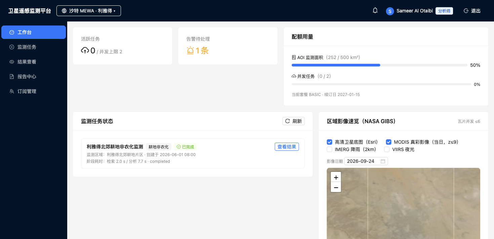

- **监测分析师**（如 Ahmed）：全功能操作——建任务、看结果、出报告；
- **决策审批者**（如 Fatima）：只读，可查看结果与告警、确认处置，无写权限；
- **租户管理员**（如 Khalid）：额外管理订阅套餐、成员与审计日志。

**隔离是产品级承诺而非页面约束**：所有业务数据按租户强制隔离，跨租户访问任何资源一律返回 404「不存在」（而非 403），即使猜测到对方的资源 ID 也无法探测其是否存在。第 7 章的「隔离自检」可一键现场验证。

---

## 三、工作台：打开就看到全局

登录后进入工作台，三类信息一屏尽览：

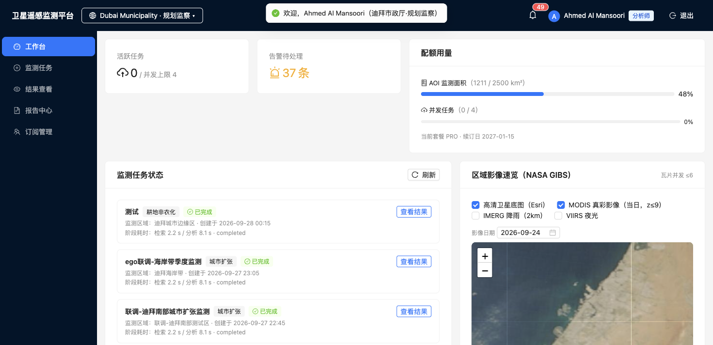

- **订阅配额**：AOI 监测面积用量（如 1211/2500 km²）、并发任务数、当前套餐与续订日；
- **监测任务状态流**：每个任务实时显示排队 / 检索中 / 分析中 / 已完成状态、分阶段耗时（检索 / 分析）、以及**降级标记与原因**（任务用了降级数据源会如实标注，绝不冒充正常结果）；
- **区域影像速览**：NASA GIBS 当日卫星底图（瓦片并发受控 ≤6），可叠加 IMERG 降雨、VIIRS 夜光图层并按日期回看；高清 Esri 底图保证放大后的细节清晰度。

---

## 四、创建监测任务：三步向导

### 第 1 步 · 圈定监测区域

支持三种方式：地图上手绘多边形、上传 GeoJSON 文件、或直接从组织级 AOI 库选择。面积实时计算并与订阅配额比对，超限即刻拦截：

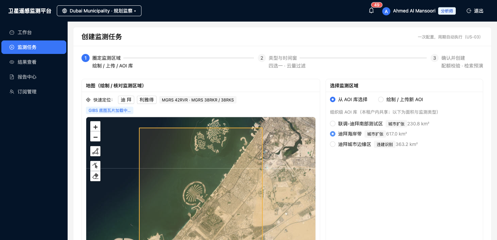

### 第 2 步 · 类型与时间窗

四类监测任选：违建识别 / 耕地非农化 / 城市扩张 / 地表变化；设定监测时间窗与云量上限（默认 ≤20%，低云保障影像质量）。

### 第 3 步 · 确认创建

汇总展示 AOI、配额校验结果与数据源说明，一键创建：

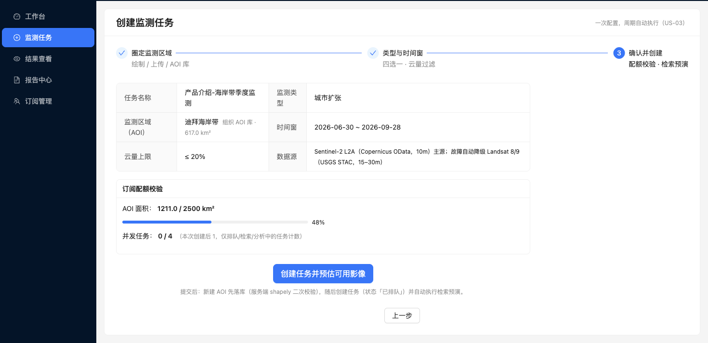

**创建即触发真实检索预演**——平台现场调用 Copernicus OData 目录（8 秒硬超时），返回监测窗口内真实可用的卫星影像清单（传感日期、云量、MGRS 分幅、产品 ID）：

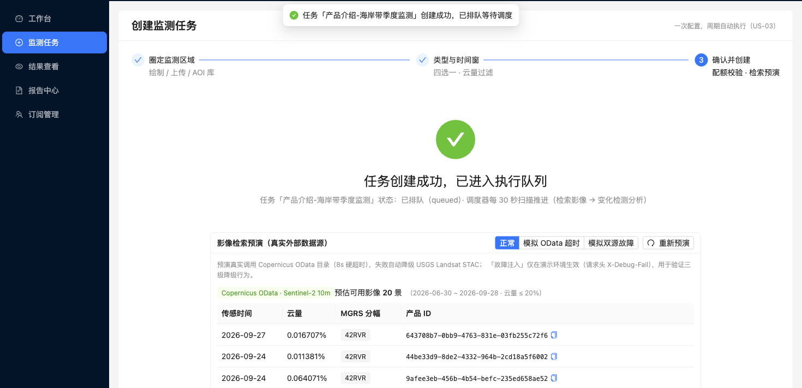

### 降级演示（也是设计能力）

外部数据源随时可能故障，平台不回避而是工程化应对。向导内置故障注入开关，一键演示三级降级链：主源 OData 超时 → 自动切换 USGS Landsat 备源（黄色横幅如实标注降级与分辨率差异）→ 双源皆败时明确提示、不展示脏数据：

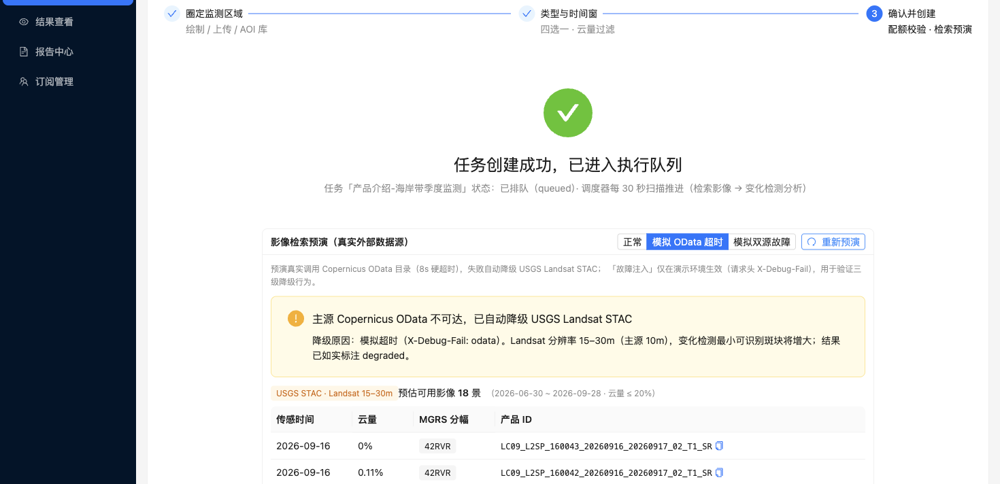

---

## 五、监测结果：变化一目了然

任务完成后进入结果查看页。地图叠加变化斑块（按置信度分色：≥80% 红、60–80% 橙、<60% 黄），支持前 / 后时相日期切换、斑块透明度调节：

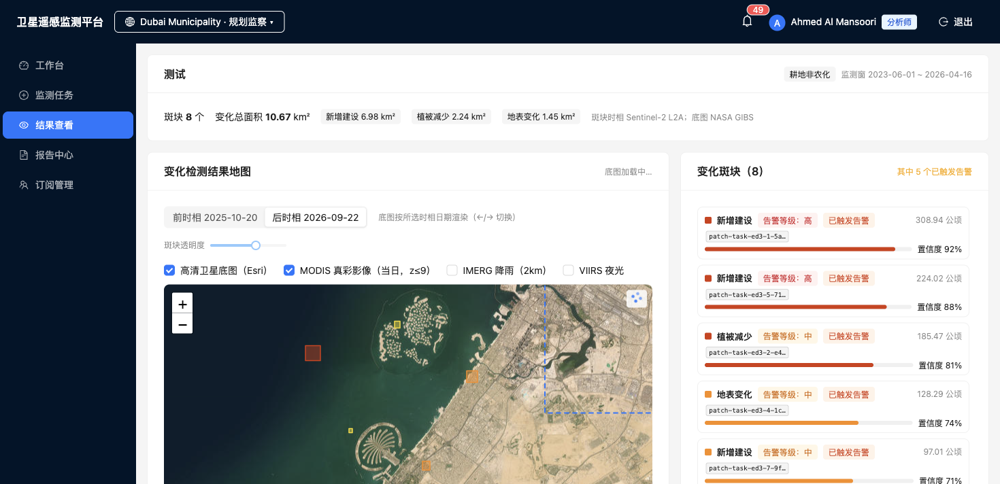

点击任一斑块，右侧展示**举证详情卡**：

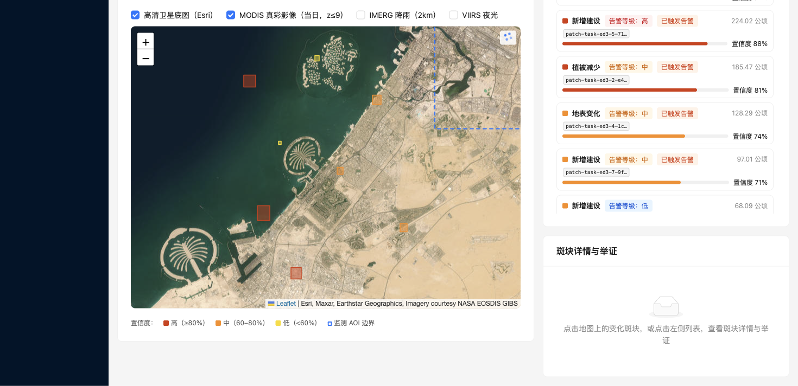

- 斑块编号、变化类型、面积、置信度、前后时相日期；
- **上下文佐证图层逐层标注可用性**：ESA WorldCover 土地利用底数、WorldPop 影响人口、IMERG 降雨背景；某层外部源不可用时如实显示「暂不可用」（如截图中的 POI 层）——降级透明是平台的基本操守；
- 告警处置闭环：确认变化 / 转现场核查 / 忽略误报，处置记录进入审计日志。

### 斑块影像详情（点击放大）

点击举证图可打开大图弹窗：前 / 后时相 1024px 对比（Esri Wayback 高清历史档案优先，网络不可达时自动降级 GIBS MODIS 并明确标注）+ Esri 亚米级现状高清参考：

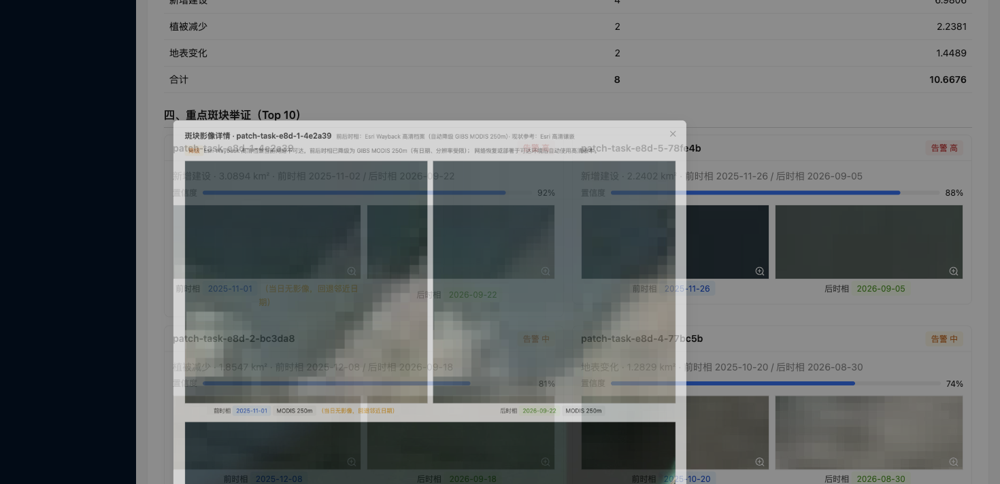

---

## 六、报告中心：一键生成汇报材料

选择已完成的任务，一键生成结构化监测报告，五章节预览直接可导出 PDF：

- **变化统计矩阵**：变化类型 × 告警等级计数矩阵（底色深浅反映占比）+ 各类型面积占比条：

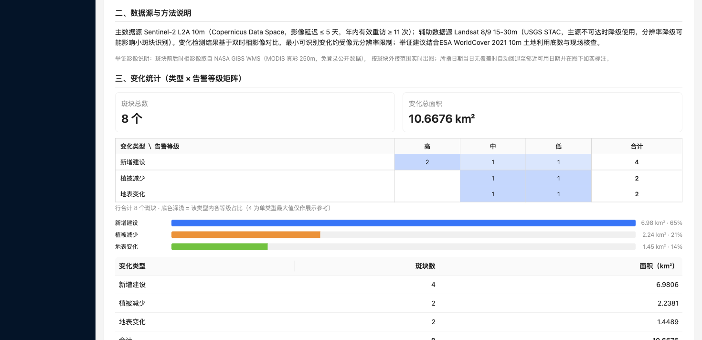

- **重点斑块举证（Top 10）**：每处斑块附真实卫星前后时相影像，点击可放大核验：

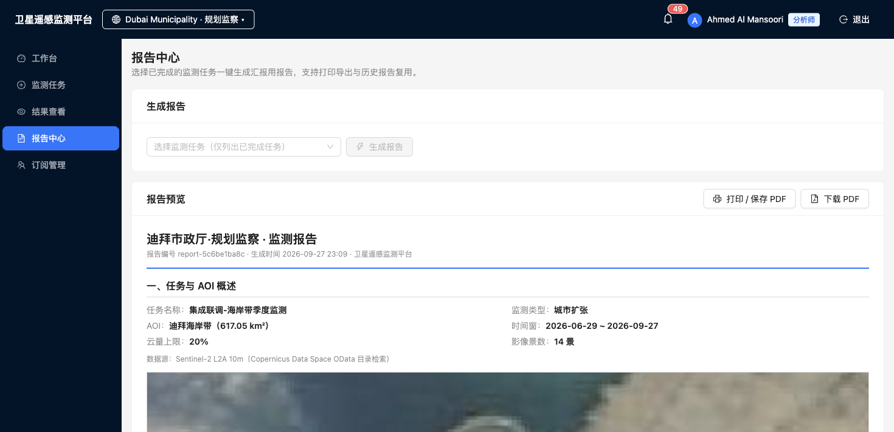

- 另含任务与 AOI 概述（附定位影像）、数据源与方法说明、数据源清单与免责声明；
- **双导出路径**：浏览器打印另存 PDF（中文排版最佳）或一键下载 PDF（自动命名：`组织_任务_时间窗_日期.pdf`）。

---

## 七、订阅管理：SaaS 的商业面

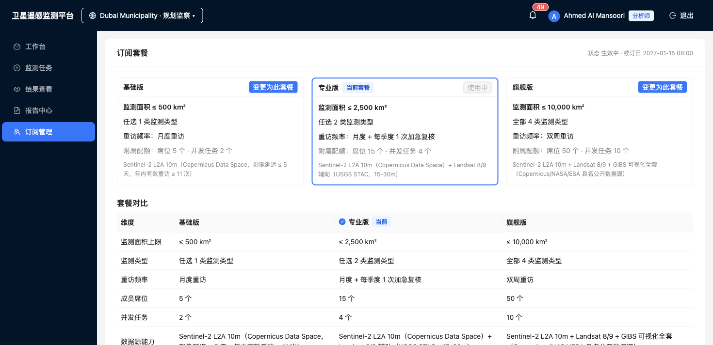

- **三档套餐**：基础版（≤500 km²、1 类监测、月度重访）/ 专业版（≤2500 km²、2 类、月度+季度加急）/ 旗舰版（≤10000 km²、4 类、双周重访），配额实时联动任务创建；
- **成员管理**：角色分配、席位管理，审批人只读权限即时生效；
- **审计日志**（仅租户管理员可见）：套餐变更、任务创建、告警处置全程留痕。

### 隔离验证一键自检

面向合规审查的现场演示入口，一条按钮跑完隔离检查：

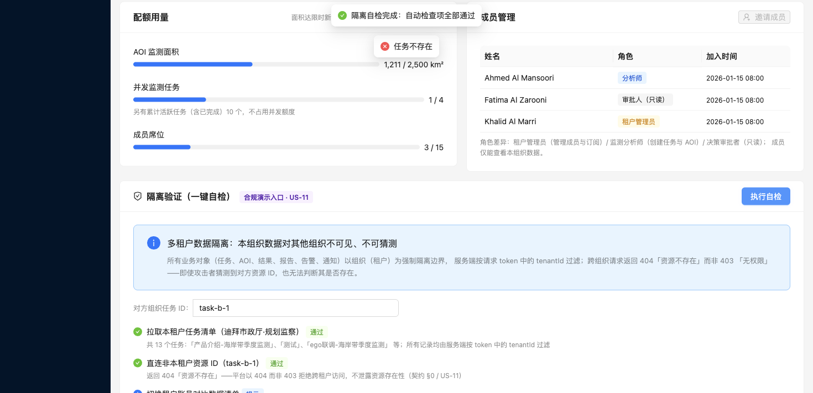

检查项包括：本租户数据清单（服务端按 token 租户过滤）→ 直连**对方租户资源 ID** 断言返回 404 → 切换租户账号对比数据集 → 审计权限分级。全部通过给出绿色结论，任何一项失败会红色告警。

---

## 八、消息中心

告警触发、任务完成等事件实时进入应用内消息中心（顶栏铃铛未读计数），处置入口直达：

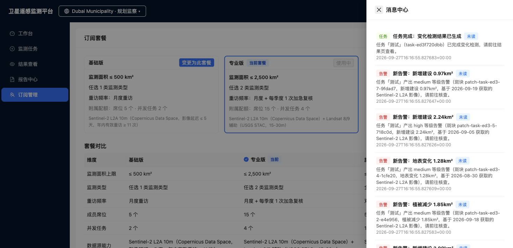

---

## 九、技术底座（一页说明）

| 维度 | 说明 |
|---|---|
| 数据源 | Copernicus OData（Sentinel-2 主源）、USGS STAC（Landsat 备源）、NASA GIBS WMTS/WMS（底图与举证影像）、Esri World Imagery / Wayback（高清底图与历史高清）、ESA WorldCover、WorldPop、Overpass POI —— 全部免登录实测可达 |
| 服务承诺（实测口径） | 目录检索 P99 < 4s；影像延迟 ≤ 5 天；年内有效重访 ≥ 11 次 |
| 故障设计 | 所有外呼 8s 硬超时、重试 0 次；主源 → 备源 → 明确兜底逐级降级；降级结果全链路如实标注 |
| 安全与隔离 | 租户行级隔离；跨租户 404 不泄露存在性；三级角色权限；审计留痕 |
| 架构 | 前端 React + Leaflet（瓦片并发 ≤6 受控）；后端 FastAPI + SQLite + APScheduler 定时调度；Docker 一键部署 |

---

*本文档所有截图取自平台真实运行环境（2026-09-28），数据为演示租户种子数据叠加真实公开卫星影像。*
